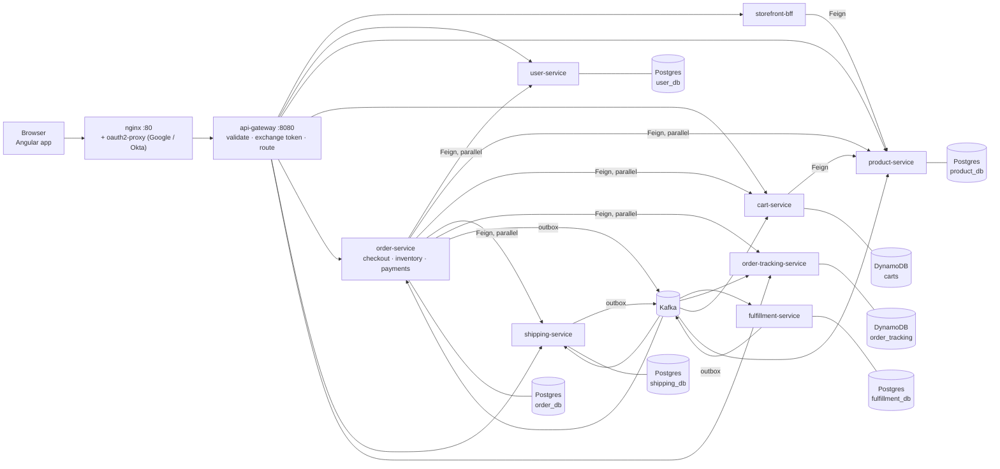
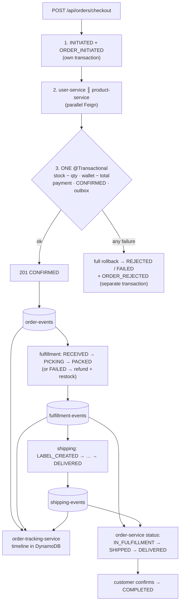
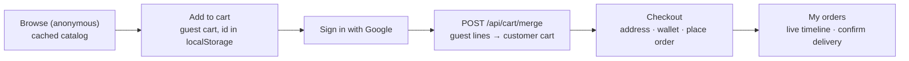

# spring-microservices-demo

An e-commerce order flow split into Spring Boot microservices, built to show common distributed-system patterns in working, tested code:

- a real ACID checkout;
- parallel API composition;
- declarative HTTP clients;
- an event-driven workflow over Kafka, with a transactional outbox;
- a CQRS read model on DynamoDB;
- a compensating saga;
- discovery and an API gateway;
- resilience;
- end-to-end tracing;
- federated sign-in with Google and Okta.

All of it sits behind an nginx edge, with an Angular storefront and admin UI on top.

It's a learning and portfolio project, so clarity beats cleverness: every pattern below points at the class that implements it and the test that proves it. The full catalog, with code excerpts, is in [docs/design-patterns.md](docs/design-patterns.md).

| | |
|---|---|
| **Stack** | Java 17 (Azul Zulu) · Spring Boot 3.5 · Spring Cloud 2025.0 (Eureka, Gateway, OpenFeign, LoadBalancer) · Resilience4j · Apache Kafka (KRaft) · PostgreSQL 16 + Flyway · Amazon DynamoDB (Local) · Spring Security (OAuth2 resource servers, internal RS256 JWTs) · nginx + oauth2-proxy · Micrometer + OpenTelemetry → Jaeger · Prometheus + Grafana · Angular 21 · Gradle 8.14 (Groovy DSL) · Testcontainers, WireMock, Awaitility, Vitest |
| **Docs** | [Architecture](docs/architecture.md) · [Sequence diagrams](docs/sequence-diagrams.md) · [Design patterns](docs/design-patterns.md) · [Events](docs/events.md) · [Security](docs/security.md) · [Observability](docs/observability.md) · [Testing Kafka](docs/testing-kafka.md) · [Testing DynamoDB](docs/testing-dynamodb.md) · [Traces](docs/tracing.md) · [Data model](data-model/README.md) · [Edge](nginx-proxy/README.md) · [Dev sign-in](dev-idp/README.md) · [Frontend](frontend/README.md) · [Build rules](CLAUDE.md) |

## Contents

- [Architecture](#architecture)
- [The order flow](#the-order-flow)
- [Patterns tour](#patterns-tour)
- [Design decisions](#design-decisions)
- [Security design](#security-design)
- [The storefront flow](#the-storefront-flow)
- [Build, deploy and test](#build-deploy-and-test)
- [Demos](#demos)
- [Repository layout](#repository-layout)
- [Next steps](#next-steps)

## Architecture



| Group | Service | Port | Role |
|---|---|---|---|
| edge | [nginx-proxy](nginx-proxy/README.md) | 80 | Serves the UI; runs the Google/Okta sign-in (oauth2-proxy); CSRF guard, rate limits, security headers; forwards `/api/**` to the gateway |
| platform | [discovery-server](platform/discovery-server/README.md) | 8761 | Eureka |
| platform | [api-gateway](platform/api-gateway/README.md) | 8080 | Validates Google/Okta tokens, exchanges them for internal JWTs, role rules, routing, circuit breakers, rate limits |
| experience | [storefront-bff](experience/storefront-bff/README.md) | 8088 | Composes the home page in parallel; no data of its own |
| identity | [user-service](domains/identity/user-service/README.md) | 8082 | Users and addresses, just-in-time registration, internal JWT issuer + JWKS |
| catalog | [product-service](domains/catalog/product-service/README.md) | 8083 | Categories, products, prices, availability levels (fed by Kafka) |
| sales | [cart-service](domains/sales/cart-service/README.md) | 8087 | Guest and customer carts on DynamoDB, merge on sign-in |
| sales | [order-service](domains/sales/order-service/README.md) | 8081 | Checkout with **inventory and wallet payments in one transaction**, aggregator, outbox, compensation, admin views |
| delivery | [fulfillment-service](domains/delivery/fulfillment-service/README.md) | 8084 | Picks and packs confirmed orders (Kafka-driven, simulated) |
| delivery | [shipping-service](domains/delivery/shipping-service/README.md) | 8085 | Shipments and simulated delivery |
| delivery | [order-tracking-service](domains/delivery/order-tracking-service/README.md) | 8086 | Records every order event as a timeline in DynamoDB (CQRS read model) |
| UI | [frontend](frontend/README.md) | via nginx | Angular storefront + admin screens under `/admin`, built into and hosted by the edge nginx |

More views, covering sync and async calls, data ownership, security layers, resilience and the runtime: **[docs/architecture.md](docs/architecture.md)**.

## The order flow



**Checkout is synchronous and ACID.** The caller gets `201 CONFIRMED`, or an error naming the reason, immediately. **Everything after checkout is asynchronous over Kafka.** Step by step, with the classes involved: **[docs/sequence-diagrams.md](docs/sequence-diagrams.md)**.

## Patterns tour

Paths are relative to the service folder (`domains/sales/order-service/src/main/java/com/smd/orderservice/` is shortened to `order-service: …`).

| # | Pattern | Where to look | Proved by |
|---|---|---|---|
| 1 | **Local ACID transaction** | order-service: `checkout/CheckoutService` (one `@Transactional`, lock order by product id, conditional `UPDATE … WHERE qty >= :n`), `checkout/OrderInitiationService`, `checkout/OrderRejectionService` (separate beans: self-invocation bypasses the proxy), `checkout/PlaceOrderUseCase` (coordinator, deliberately not transactional); `CHECK` constraints in `data-model/sql/01-order_db.sql` | `CheckoutTest` (rollback of the first item when the second is out of stock; insufficient funds), `CheckoutConcurrencyTest` (10 threads, last unit → 1 confirmed, stock never negative) |
| 2 | **Idempotency** | `PlaceOrderUseCase` (Idempotency-Key, unique constraint race), `checkout/CheckoutFromCartUseCase` (derived key `cart:<id>:<createdAt>:v<version>`); wallet top-ups (`wallet/WalletService`) | `CheckoutTest`, `CheckoutFromCartTest`, `WalletTest` |
| 3 | **API composition / aggregator** | order-service: `composition/ParallelCalls`, `composition/CompositionExecutorConfig` (bounded, named `compose-*`, `CallerRunsPolicy`, `ContextPropagatingTaskDecorator`; comment on Java 17 vs virtual threads), `details/OrderDetailsService` (4 calls in parallel, degraded sections); storefront-bff: `storefront/StorefrontService` | `OrderDetailsTest`, `ParallelCallsTest` (JWT and MDC on worker threads), `StorefrontTest`; [demo 5](#5-slow-downstream--parallel-vs-sequential-timing) |
| 4 | **Declarative HTTP clients (OpenFeign)** | order-service `client/<service>/` (Client, DTOs, ErrorDecoder, Adapter), `client/FeignHeadersInterceptor` (relays JWT, correlation id); YAML `spring.cloud.openfeign.client.config.*` (timeouts per client, hc5 pool) | `FeignClientTest`, `UserAdapterTest`, `ProductAdapterTest`, `ShippingAdapterTest`, `TrackingAdapterTest`, `CartAdapterTest` (WireMock: success, 404, 500 + retry, timeout, circuit opens) |
| 5 | **Event-driven workflow + transactional outbox** | `outbox/OutboxWriter`, `outbox/OutboxRelay` (dual-write comment, `FOR UPDATE SKIP LOCKED`, stop on first failure) in order-, fulfillment- and shipping-service; listeners: fulfillment `fulfillment/OrderEventsListener`, shipping `shipment/FulfillmentEventsListener`, order `delivery/DeliveryEventsListener`; idempotency `ProcessedEvents`; DLT in each `KafkaConsumerConfig`; contract [docs/events.md](docs/events.md) | `OutboxRelayTest`, `OutboxRelayFailureTest`, `FulfillmentFlowTest` and `ShippingFlowTest` (duplicate handled once, poison message → DLT), `DeliveryEventsTest` (status only moves forward) |
| 6 | **CQRS read model on DynamoDB** | order-tracking-service: `persistence/TrackingRepository` (one `TransactWriteItems`: put event IF not exists + update state IF rank is higher; outcomes written/duplicate/stale), `tracking/StatusRanks`, `persistence/DynamoDbTableInitializer`; availability levels in product-service `availability/` | `TrackingRepositoryTest`, `OrderEventsConsumerTest`, `TrackingIntegrationTest`, product `AvailabilityTest` |
| 7 | **Saga (choreography, one compensation)** | order-service `compensation/OrderCancellationService` (restock + refund + CANCELLED in one transaction, idempotent) | `CompensationTest` (failure rate 100% → stock and wallet restored, timeline ends `ORDER_CANCELLED`); [demo 7](#7-fulfillment-fails--refund--restock) |
| 8 | **Discovery + client-side load balancing** | `platform/discovery-server`; every service is a Eureka client; Feign and the gateway resolve `lb://service-name` | [demo 9](#9-load-balancing-across-two-product-service-instances) |
| 9 | **API gateway** | api-gateway `application.yml` (routes, per-route circuit breaker and timeouts, bulkhead), `filter/CorrelationIdFilter`, `filter/RequestLoggingFilter`, `fallback/FallbackController`, `ratelimit/InMemoryRateLimiter` | `RoutingTest`, `RateLimitTest` |
| 10 | **Resilience** | Resilience4j on the adapters (`@Retry` → `@CircuitBreaker` → `@Bulkhead`, aspect order set in YAML and commented); `resilience4j.*` in order-service, cart-service and storefront-bff `application.yml`; chaos toggles `chaos/` in user- and product-service | adapter tests above; [demos 5–6](#demos) |
| 11 | **Observability** | `outbox/OutboxTracing` (trace continued through the outbox), `observability/` in every service, `kafka/OrderIdLogContext`, `KafkaHealthIndicator`, checkout metrics in `PlaceOrderUseCase`; Grafana `docker/grafana/provisioning/dashboards/smd-overview.json`; [docs/observability.md](docs/observability.md) | `OutboxTracingTest`, `CheckoutMetricsTest`; [demo 8](#8-follow-one-order-in-jaeger-and-the-tracking-timeline) |
| 12 | **Federated sign-in, token exchange, roles** | nginx `nginx-proxy/nginx/templates/default.conf.template`; gateway `security/TrustedIssuers`, `security/SecurityConfig`, `exchange/TokenExchangeFilter`; user-service `auth/TokenExchangeService`, `auth/UserProvisioning`, `auth/InternalTokenIssuer`; each service `security/SecurityConfig` + `CurrentUser`; [docs/security.md](docs/security.md) | `GatewaySecurityTest`, `DevIssuerSecurityTest`, `TokenExchangeTest`, `OrderSecurityTest` (ownership → 404) |
| 13 | **Storefront: cache, BFF, guest cart** | product-service `CachingConfig`, `api/CatalogHttpCaching` (Cache-Control + ETag for anonymous responses); storefront-bff; cart-service `cart/CartService`, `persistence/CartRepository` (version conditions, merge transaction, TTL), `cart/CheckoutClearing` | `CatalogHttpCachingTest`, `CartApiTest`, `CartConcurrencyAndTtlTest`, `CheckoutClearingTest`, `BffIntegrationTest` |
| 14 | **Edge proxy** | `nginx-proxy/` (public catalog, optional session on the cart, per-path login, CSRF, rate limits, headers) | checked by hand ([nginx-proxy/README.md](nginx-proxy/README.md)) |

## Design decisions

### Inventory and payment in one database (and why there's no payment service)

`@Transactional` only covers one database. To make *enough stock → decrement stock → take payment → confirm order* truly atomic, the `inventory`, `customer_wallets` and `payments` tables live in `order_db`, forming one bounded context, **checkout**, inside order-service.
- **Payment is an internal wallet** (a balance that is debited), so it can join the transaction: either everything happens or nothing does ([demo 2](#2-out-of-stock-rollback-proof), [demo 3](#3-insufficient-funds)).
- **A real card processor is an external system** and can't join a database transaction. It would need *authorize → capture*, with a compensating refund or void when a later step fails, i.e. a saga around the payment.
- **The price of this choice** is a bigger checkout context. There is no separate payment or inventory service on purpose.

### Where Kafka is used, and where it is not

**Checkout is not on Kafka.** It needs an immediate answer and an ACID guarantee. **Kafka connects everything after checkout:** fulfillment → shipping → delivery, order status updates, cart clearing, catalog availability and the tracking timeline.
- **Every producer uses a transactional outbox:** the event row commits with the business change, and a relay publishes it. That avoids the dual-write problem (commit with a lost send, or a send for a rolled-back change).
- **Delivery is at least once**, and every consumer is idempotent.

### Why DynamoDB here (and not in order-service)

- **order-tracking-service** is the clearest fit:
  - it's always accessed by order id;
  - writes are append-heavy (one item per event);
  - there are no joins or multi-entity transactions;
  - the table can be **rebuilt by replaying the topics** (a new consumer group from the earliest offset).

  Conditional writes make it idempotent and forward-only without a `processed_event` table (diagram: [§7](docs/sequence-diagrams.md#7-tracking-write-idempotent-and-forward-only)).
- **Carts** are key-value too, short-lived (TTL), with optimistic locking on `version`.
- **order-service stays on Postgres**, because checkout relies on relational constraints (`quantity_on_hand >= 0`, `balance >= 0`) and one `@Transactional`.
- **In real AWS** the tables would come from infrastructure-as-code. Here a `DynamoDbTableInitializer` creates them in the `local`/`docker` profiles and in tests.
- **Admin listings** use Postgres, never a DynamoDB `Scan`.

### Choreography, not orchestration

The only cross-service failure left after a successful checkout is *fulfillment fails after payment*. order-service reacts to `FULFILLMENT_FAILED` by restocking, refunding and cancelling in one local transaction. Nobody coordinates it: services react to each other's events (**choreography**).

An **orchestrated** saga would have a central component sending commands ("reserve", "charge", "ship") and the compensations. That makes the flow easier to see in one place, but adds a component to build and run. Here, the tracking timeline and the traces are how you see the flow.

### Gateway vs. BFF

- **The gateway routes and secures every request.** It validates tokens, exchanges them, applies role rules, rate limits and circuit breakers.
- **The BFF composes data for one client.** `GET /api/storefront/home` fans out to product-service in parallel and shapes the home page.
- Neither owns data. fulfillment-service is deliberately **not exposed** through the gateway: nothing outside needs to call it.

## Security design

Three layers, each enforcing on its own ([docs/security.md](docs/security.md), [diagram](docs/sequence-diagrams.md#1-sign-in-and-token-exchange)):

1. **nginx + oauth2-proxy (edge)**
   - Customers sign in with **Google**; the first sign-in registers them.
   - Admins sign in with **Okta** and must be in the group `smd-admins`.
   - The browser only holds HttpOnly session cookies. nginx forwards the Google ID token or Okta access token as a bearer token.
   - Also handled at the edge: CSRF (`X-Requested-With` on state-changing calls), rate limits, security headers, blocked internal paths.
2. **api-gateway**
   - Trusts exactly Google, Okta and, in `local` only, the dev identity provider. It checks issuer, audience, expiry and the admin group.
   - Exchanges the external token for a 5-minute **internal JWT** from user-service, cached per token.
   - Applies the route role rules.
3. **Services** trust only the internal issuer and check roles and ownership. Someone else's order is a **404**, never 403, so ids can't be probed.

**Sample users (local only).** They sign in through the mock OIDC server in [`dev-idp/`](dev-idp/README.md), on the same path as real users. There are no passwords anywhere.

| Sign in as | Plays | Is | Notes |
|---|---|---|---|
| `sample-customer` | a Google customer | `customer@demo.local`, `CUSTOMER` | default address, wallet 500.00 USD |
| `sample-admin` | an Okta admin in `smd-admins` | `admin@demo.local`, `ADMIN` | |
| `sample-not-admin` | an Okta user outside the group | — | refused (tests the group rule) |

In the browser, click the user on the mock login page. For curl: `dev-idp/dev-token.sh customer|admin|not-admin`.

## The storefront flow



- **Browsing is anonymous and cached:**
  - Caffeine in product-service;
  - `Cache-Control` and ETags on anonymous responses;
  - a 30 s cache on the BFF home page.
- **Availability** is a level (`IN_STOCK` / `LOW_STOCK` / `OUT_OF_STOCK`), never a count. order-service publishes `INVENTORY_CHANGED` on every stock change, and product-service keeps the levels.
  - That makes it **eventually consistent**: it can lag a moment.
  - The checkout transaction is the authoritative check, so the worst case is "shown in stock, rejected at checkout with `409`".
- **The guest cart id** is an unguessable bearer secret. It's kept in `localStorage` and sent as `X-Cart-Id`, never as a cookie.
- **After sign-in** the app merges the guest cart into the customer's cart (idempotent).
- **Checkout reads the customer's cart.** The cart is emptied asynchronously, when cart-service sees `ORDER_CONFIRMED`, so a failed checkout leaves it untouched.

Diagram: [§2](docs/sequence-diagrams.md#2-guest-cart--sign-in--merge).

## Build, deploy and test

Everything runs locally:
- **infrastructure** in Docker Compose;
- the **10 Spring Boot services** on your machine;
- the **edge** in Docker Compose: one nginx that builds and hosts the Angular app, plus oauth2-proxy, Redis and the mock sign-in.

### Prerequisites

- Docker;
- JDK: any JDK can run Gradle, which downloads Azul Zulu 17 through toolchains;
- Node.js 20.19+, 22.12+ or 24+, only for UI development and its tests: the nginx image builds the app itself;
- `jq` and `uuidgen`, for the demos.

Once:

```bash
./scripts/generate-dev-keys.sh         # RSA key pair for internal JWTs (.local/keys, git-ignored)
```

### 1. Build

```bash
./gradlew build                          # compile + all backend tests (Testcontainers; needs Docker, not the running stack)
./gradlew :order-service:test            # one module's tests
cd frontend && npm ci && npx ng test --watch=false && cd ..      # UI unit tests (Vitest)
```

`./gradlew build` also produces the runnable jars (`<service>/build/libs/<name>-0.1.0-SNAPSHOT.jar`). The edge image, with the Angular app inside, is built by Docker Compose in step 2. To build it on its own:

```bash
cd nginx-proxy && docker compose build nginx && cd ..
```

### 2. Deploy (local)

**Infrastructure:** Postgres, DynamoDB Local, Kafka, Kafka UI, Jaeger, Prometheus, Grafana.

```bash
docker compose -f docker/docker-compose.yml up -d
```

**Services**, in this order: discovery-server → user, product, fulfillment, shipping, tracking, cart → order-service → storefront-bff → api-gateway. Either run each in its own terminal:

```bash
./gradlew :discovery-server:bootRun --args='--spring.profiles.active=local'
# then: user-service, product-service, fulfillment-service, shipping-service, order-tracking-service, cart-service
./gradlew :order-service:bootRun --args='--spring.profiles.active=local'
./gradlew :storefront-bff:bootRun --args='--spring.profiles.active=local'
./gradlew :api-gateway:bootRun --args='--spring.profiles.active=local'
```

…or start all of them in the background from the jars of step 1 (logs in `/tmp/<service>.log`):

```bash
start() { nohup java -jar $1/build/libs/$(basename $1)-0.1.0-SNAPSHOT.jar --spring.profiles.active=local > /tmp/$(basename $1).log 2>&1 < /dev/null & }
up() { until curl -sf -o /dev/null localhost:$1/actuator/health; do sleep 2; done; echo "$1 up"; }
start platform/discovery-server; up 8761
for s in domains/identity/user-service domains/catalog/product-service domains/delivery/fulfillment-service \
         domains/delivery/shipping-service domains/delivery/order-tracking-service domains/sales/cart-service; do start $s; done
for p in 8082 8083 8084 8085 8086 8087; do up $p; done
start domains/sales/order-service; up 8081
start experience/storefront-bff; up 8088
start platform/api-gateway; up 8080
```

**Edge:** nginx (built with the Angular app inside), oauth2-proxy, Redis, and the mock sign-in, so no Google or Okta account is needed:

```bash
cd nginx-proxy && docker compose -f docker-compose.yml -f ../dev-idp/docker-compose.dev-idp.yml \
  --profile google --profile okta --profile dev-idp up -d --build && cd ..
```

With real Google and Okta, follow [nginx-proxy/README.md](nginx-proxy/README.md) and [okta-login-setup/README.md](okta-login-setup/README.md), and drop the `dev-idp` override.

### 3. Check it's up

```bash
docker ps --format '{{.Names}}\t{{.Status}}' | grep '^smd' | sort          # 8 infra + 5 edge containers
for p in 8761 8082 8083 8084 8085 8086 8087 8081 8088 8080; do
  echo "$p $(curl -s -o /dev/null -w '%{http_code}' localhost:$p/actuator/health)"; done          # all 200
for u in / /cart /api/storefront/home /api/categories /products/daypack-25l.svg; do
  echo "$u $(curl -s -o /dev/null -w '%{http_code}' http://localhost$u)"; done                    # all 200, through nginx
curl -s -o /dev/null -w '/api/orders anonymous: %{http_code}\n' http://localhost/api/orders       # 401 (sign in first)
curl -s -o /dev/null -w '/admin anonymous: %{http_code}\n' http://localhost/admin                # 302 to the admin sign-in
```

Readiness, with database, DynamoDB and Kafka checks: `curl -s localhost:8081/actuator/health/readiness | jq`.

| Open | What |
|---|---|
| http://localhost | the store. "Sign in with Google" goes to the mock login → `sample-customer` |
| http://localhost/admin | admin screens → `sample-admin` |
| http://localhost:16686 | Jaeger (traces) |
| http://localhost:3000 | Grafana, dashboard *spring-microservices-demo* |
| http://localhost:9090 | Prometheus (Status → Targets: all 10 services up) |
| http://localhost:8090 | Kafka UI (topics, DLTs) |
| http://localhost:8001 | DynamoDB admin |
| http://localhost:8761 | Eureka |

### 4. Test the app

**In the browser** (http://localhost):

| Try | Expect |
|---|---|
| Browse anonymously: home, a category, search, a product | catalog with availability levels; nothing asks you to sign in |
| Add to cart while signed out, then **Sign in with Google** → `sample-customer` | you come back signed in, and the guest cart is merged into the customer's cart |
| **Checkout:** address, wallet (top up if needed), *Place order and pay* | `201`, then the order page refreshes itself: confirmed → in fulfillment → shipped → delivered (about 15 s in `local`) |
| *Confirm delivery* on a delivered order | status COMPLETED; the timeline ends with the acknowledgement |
| http://localhost/admin → `sample-admin` | orders, payments, shipments, inventory; a restock shows up on the storefront a moment later |
| Admin sign-in as `sample-not-admin` (fresh session) | `403` from oauth2-proxy (not in `smd-admins`) |
| Order a product that's out of stock, or more than the wallet holds | a clear error (`409` / `402`); the rejected order is still listed and tracked |

To start over as someone else, sign out: `/oauth2/customer/sign_out?rd=/` or `/oauth2/admin/sign_out?rd=/`.

**Behind the scenes:**
- **Jaeger:** service `order-service`, operation `http post /api/orders/checkout`. One order is one trace across the gateway, Kafka and every service.
- **Grafana:** checkout outcomes, outbox pending, consumer lag.
- **Kafka UI:** `order-events`, `fulfillment-events`, `shipping-events`, `inventory-events`.

**Hands-on guides:** [testing Kafka](docs/testing-kafka.md) (topics, lag, outbox, duplicates, DLT), [testing DynamoDB](docs/testing-dynamodb.md) (timelines, idempotent writes, cart versions, TTL), [looking at traces](docs/tracing.md).

**From the command line:** the [demos](#demos) below script the interesting cases (rollback, insufficient funds, concurrency, parallel timing, circuit breaker, compensation, load balancing) against the gateway with tokens from the mock sign-in.

### 5. Change and redeploy

| You changed | Do |
|---|---|
| A service | `./gradlew :<service>:bootJar`, then restart it (Ctrl+C + `bootRun`, or kill its `java -jar` and `start` it again) |
| The Angular app | `cd nginx-proxy && docker compose up -d --build nginx` (rebuilds the image with the app) |
| The Angular app, often | `npx ng build --watch` in `frontend/`, plus the `nginx-proxy/docker-compose.ui-watch.yml` override: every rebuild is live on the next page load ([frontend/README.md](frontend/README.md#run-it)) |
| The nginx config (`nginx-proxy/nginx/`) | `docker compose exec nginx nginx -t && docker compose exec nginx nginx -s reload` (from `nginx-proxy/`; the config is mounted) |
| A database migration | add `V<n>__….sql` in the service **and** update `data-model/`; it applies on the next start |

### 6. Stop and clean up

```bash
pkill -f 'build/libs/.*-0.1.0-SNAPSHOT.jar'          # services started with java -jar (or Ctrl+C each bootRun)
cd nginx-proxy && docker compose -f docker-compose.yml -f ../dev-idp/docker-compose.dev-idp.yml \
  --profile google --profile okta --profile dev-idp down && cd ..       # edge containers
docker compose -f docker/docker-compose.yml down                        # infrastructure (data volumes are kept)
docker image rm smd-edge-nginx:local                                    # optional: the edge image (rebuilt by up --build)
```

`docker compose -f docker/docker-compose.yml down -v` also **deletes the data volumes**: Postgres, DynamoDB Local and Grafana. The next start re-seeds the sample data.

## Demos

Every demo below was run against the local stack in phase 16. They call the gateway on `:8080` directly (open in the `local` profile) with tokens from the mock sign-in. Run them in one shell, from the repository root, after this setup:

```bash
API=http://localhost:8080
CUSTOMER=$(dev-idp/dev-token.sh customer)
ADMIN=$(dev-idp/dev-token.sh admin)
c() { curl -s -H "Authorization: Bearer $CUSTOMER" -H 'Content-Type: application/json' "$@"; }
a() { curl -s -H "Authorization: Bearer $ADMIN" -H 'Content-Type: application/json' "$@"; }
item() { echo "{\"productId\":\"$1\",\"quantity\":$2}"; }
order() { local items=$1; shift; c -X POST $API/api/orders -H "Idempotency-Key: $(uuidgen)" -d "{\"items\":[$items]}" "$@"; }
stock() { a $API/api/admin/inventory | jq -r --arg id "$1" '.items[] | select(.productId == $id) | .quantityOnHand'; }
chaos() { curl -s -X POST localhost:$1/internal/chaos -H 'Content-Type: application/json' -d "$2"; echo; }
EARBUDS=20000000-0000-4000-8000-000000000001   # 79.99
CHARGER=20000000-0000-4000-8000-000000000002   # 39.99
KEYBOARD=20000000-0000-4000-8000-000000000003  # 129.00
MONITOR=20000000-0000-4000-8000-000000000004   # 349.00, little stock
```

Tokens from the mock server last an hour. Re-run the two `dev-token.sh` lines if calls start returning 401.

### 1. Happy path through delivery

```bash
ORDER=$(order "$(item $CHARGER 1)" | jq -r .id); echo $ORDER
for i in $(seq 1 12); do c $API/api/tracking/orders/$ORDER/latest | jq -r .currentStatus; sleep 2; done   # moves on its own (~15 s)
c -X POST $API/api/orders/$ORDER/acknowledge-delivery | jq -r .status                                     # COMPLETED
c $API/api/tracking/orders/$ORDER | jq -r '[.timeline[].status] | join(" > ")'
```

```
ORDER_INITIATED > INVENTORY_RESERVED > PAYMENT_CAPTURED > ORDER_CONFIRMED > FULFILLMENT_RECEIVED > FULFILLMENT_PICKING > FULFILLMENT_PACKED > SHIPMENT_CREATED > SHIPMENT_PICKED_UP > SHIPMENT_IN_TRANSIT > SHIPMENT_OUT_FOR_DELIVERY > SHIPMENT_DELIVERED > ORDER_DELIVERED > DELIVERY_ACKNOWLEDGED
```

### 2. Out of stock (rollback proof)

The first item is in stock and the second isn't. The first item's decrement is rolled back with everything else:

```bash
echo "before: earbuds $(stock $EARBUDS), monitor $(stock $MONITOR)"
order "$(item $EARBUDS 1),$(item $MONITOR 10)" | jq -c '{status, reason, orderId}'
echo "after:  earbuds $(stock $EARBUDS), monitor $(stock $MONITOR)"
```

```
before: earbuds 35, monitor 3
{"status":409,"reason":"OUT_OF_STOCK","orderId":"638c1094-…"}
after:  earbuds 35, monitor 3
```

The rejected order still exists and is tracked: `c $API/api/tracking/orders/<orderId> | jq '.timeline[].status'` ends with `ORDER_REJECTED`.

### 3. Insufficient funds

$1,199.80 of goods, more than the sample wallet holds (top-ups are capped at $1,000 each):

```bash
c $API/api/wallet | jq .balance
order "$(item $EARBUDS 10),$(item $CHARGER 10)" | jq -c '{status, reason, orderId}'
echo "balance $(c $API/api/wallet | jq .balance), earbuds $(stock $EARBUDS)"   # both unchanged
```

```
{"status":402,"reason":"INSUFFICIENT_FUNDS","orderId":"802d1ead-…"}
```

### 4. Concurrent orders for the last units

Fire N + 10 single-unit orders at once for a product with N left. Exactly N succeed, and stock ends at 0, never negative:

```bash
for i in 1 2; do c -X POST $API/api/wallet/top-ups -H "Idempotency-Key: $(uuidgen)" -d '{"amount":1000}' > /dev/null; done   # demo money
LEFT=$(stock $KEYBOARD); echo "keyboards left: $LEFT"
for i in $(seq 1 $((LEFT + 10))); do order "$(item $KEYBOARD 1)" -o /dev/null -w '%{http_code}\n' & done | sort | uniq -c; wait
echo "keyboards now: $(stock $KEYBOARD)"
a -X POST $API/api/admin/inventory/$KEYBOARD/restock -d '{"quantity":10,"note":"after the demo"}' | jq -c .
```

```
keyboards left: 10
  10 201
  10 409
keyboards now: 0
```

### 5. Slow downstream → parallel vs. sequential timing

Make user-service and product-service each take 1.5 s. The details aggregator calls them, plus shipping and tracking, in parallel, so the total is about the slowest call, not the sum:

```bash
chaos 8082 '{"latencyMs":1500}'; chaos 8083 '{"latencyMs":1500}'
c -o /dev/null -w 'details took %{time_total}s\n' $API/api/orders/$ORDER/details       # ≈ 1.5 s, not 3 s
chaos 8082 '{"latencyMs":0}'; chaos 8083 '{"latencyMs":0}'
```

order-service's log (`local`) shows the elapsed time of each call next to the total.

### 6. Circuit breaker opening

```bash
chaos 8083 '{"failureRate":1.0}'
for i in $(seq 1 12); do c $API/api/orders/$ORDER/details | jq -c '{degraded, unavailableSections}'; done | sort | uniq -c
curl -s localhost:8081/actuator/health | jq -c '.components.circuitBreakers.details | map_values(.details.state)'
c -o /dev/null -w 'with the circuit open: %{time_total}s\n' $API/api/orders/$ORDER/details   # fails fast
chaos 8083 '{"failureRate":0.0}'
```

```
  12 {"degraded":true,"unavailableSections":["products"]}
{"productService":"OPEN", "userService":"CLOSED", …}
with the circuit open: 0.016s
```

The response is degraded, never a 500. After 10 s the breaker goes HALF_OPEN and closes again once calls succeed.

### 7. Fulfillment fails → refund + restock

Restart fulfillment-service with a 100% failure rate:

```bash
./gradlew :fulfillment-service:bootRun --args='--spring.profiles.active=local --demo.simulation.failure-rate=1.0'
```

Then:

```bash
echo "before: wallet $(c $API/api/wallet | jq .balance), chargers $(stock $CHARGER)"
ORDER=$(order "$(item $CHARGER 2)" | jq -r .id)
echo "after checkout: wallet $(c $API/api/wallet | jq .balance), chargers $(stock $CHARGER)"
sleep 8
echo "after compensation: wallet $(c $API/api/wallet | jq .balance), chargers $(stock $CHARGER), order $(c $API/api/orders/$ORDER | jq -r .status)"
c $API/api/tracking/orders/$ORDER | jq -r '[.timeline[].status] | join(" > ")'
```

```
before: wallet 789.66, chargers 97
after checkout: wallet 709.68, chargers 95
after compensation: wallet 789.66, chargers 97, order CANCELLED
ORDER_INITIATED > INVENTORY_RESERVED > PAYMENT_CAPTURED > ORDER_CONFIRMED > FULFILLMENT_RECEIVED > FULFILLMENT_FAILED > INVENTORY_RESTORED > PAYMENT_REFUNDED > ORDER_CANCELLED
```

Restart fulfillment-service normally afterwards.

### 8. Follow one order in Jaeger and the tracking timeline

```bash
c -X POST $API/api/cart/items -d "$(item $CHARGER 1)" > /dev/null
c -X POST $API/api/orders/checkout -H 'X-Correlation-Id: demo-trace-1' | jq -r '.id + " " + .status'
```

- **Find the trace:**
  - In order-service's log, every line of that request shows `[order-service,<traceId>,<spanId>,demo-trace-1,<orderId>]`.
  - Or, in Jaeger (http://localhost:16686), pick service `order-service` and operation `http post /api/orders/checkout`.
- **The trace** covers the whole life of the order, about 70 spans across 8 services:
  - the checkout, with its user and product calls starting at the same moment;
  - the `outbox publish …` spans and Kafka send/receive;
  - fulfillment's and shipping's simulated steps;
  - the order-service status updates, cart clearing and tracking writes, up to `ORDER_DELIVERED`.
- **The same order's timeline:** `c $API/api/tracking/orders/<orderId> | jq`. In the UI it's on *My orders*.
- **Grafana** shows the checkout in *Checkout outcomes*, and the outbox and consumer-lag panels move with it.

### 9. Load balancing across two product-service instances

```bash
java -jar domains/catalog/product-service/build/libs/product-service-0.1.0-SNAPSHOT.jar --spring.profiles.active=local --server.port=8093
```

Wait about 30 s for Eureka and the callers' caches to see the second instance, then:

```bash
cnt() { curl -s localhost:$1/actuator/prometheus | grep 'http_server_requests_seconds_count{.*status="200",uri="/api/products"' | awk '{s+=$2} END {print s+0}'; }
b1=$(cnt 8083); b2=$(cnt 8093)
for i in $(seq 1 20); do c -o /dev/null $API/api/orders/$ORDER/details; done
echo "8083: $(( $(cnt 8083) - b1 )), 8093: $(( $(cnt 8093) - b2 ))"
```

```
8083: 10, 8093: 10
```

order-service's Feign client resolves `product-service` through Eureka, and Spring Cloud LoadBalancer round-robins across both instances.

## Repository layout

```
├── platform/            discovery-server, api-gateway
├── experience/          storefront-bff
├── domains/
│   ├── identity/        user-service
│   ├── catalog/         product-service
│   ├── sales/           cart-service, order-service
│   └── delivery/        fulfillment-service, shipping-service, order-tracking-service
├── frontend/            Angular app (npm, not part of the Gradle build)
├── nginx-proxy/         nginx + oauth2-proxy + Redis (edge)
├── dev-idp/             mock OIDC server for local sign-in
├── okta-login-setup/    Okta setup guide
├── data-model/          reviewed schemas, seeds, diagrams, SQL tests
├── docker/              infrastructure compose, Prometheus, Grafana
├── docs/                architecture, sequence diagrams, events, security, observability
├── build-logic/         Gradle convention plugins (Groovy)
└── gradle/              version catalog + wrapper
```

- **Gradle project names are flat** (`./gradlew :order-service:test`), mapped to their folders in `settings.gradle`.
- **Every version** is in `gradle/libs.versions.toml`.
- **No shared code between services:** each owns its DTOs and event classes.

## Next steps

- **Real sign-in with Google and Okta (rest of phase 13).** The edge has been verified end to end with the dev identity provider (`dev-idp/`) only. To finish:
  1. Create the Google OAuth client (`nginx-proxy/README.md`) and the Okta app plus `smd-admins` group (`okta-login-setup/README.md`).
  2. Copy `nginx-proxy/.env.example` to `nginx-proxy/.env` and fill it in (never commit it).
  3. Start the edge without the dev-idp override: `cd nginx-proxy && docker compose --profile google --profile okta up -d`.
  4. Start the gateway and user-service with `GOOGLE_CLIENT_ID` and `OKTA_ISSUER_URI=https://<OKTA_DOMAIN>/oauth2/default`.
  5. Verify: anonymous browsing, a first Google sign-in registers a `CUSTOMER`, an Okta admin in `smd-admins` reaches `/admin`, an Okta user outside the group is refused, CSRF and blocked paths. Record the result in `nginx-proxy/README.md`.
- **Playwright end-to-end test for the storefront** (optional in CLAUDE.md 6.12): browse → guest cart → sign-in (dev-idp) → merge → checkout. The flow was verified by hand in phase 14; unit tests cover the interceptor, guards, session and cart store (`frontend/README.md`).
- **The correlation id stops at the outbox.** Async work is linked by the trace id instead. Carrying the correlation id too would need an `outbox_event` column ([docs/observability.md](docs/observability.md)).
- **Later, only when wanted** (CLAUDE.md section 9):
  - Kafka transactions / exactly-once;
  - Debezium CDC instead of the polling relay;
  - Server-Sent Events for tracking;
  - real card payments (authorize/capture);
  - Avro + Schema Registry;
  - load tests (k6/Gatling);
  - Kubernetes manifests.
