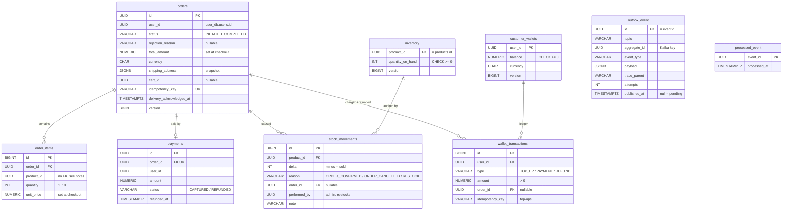
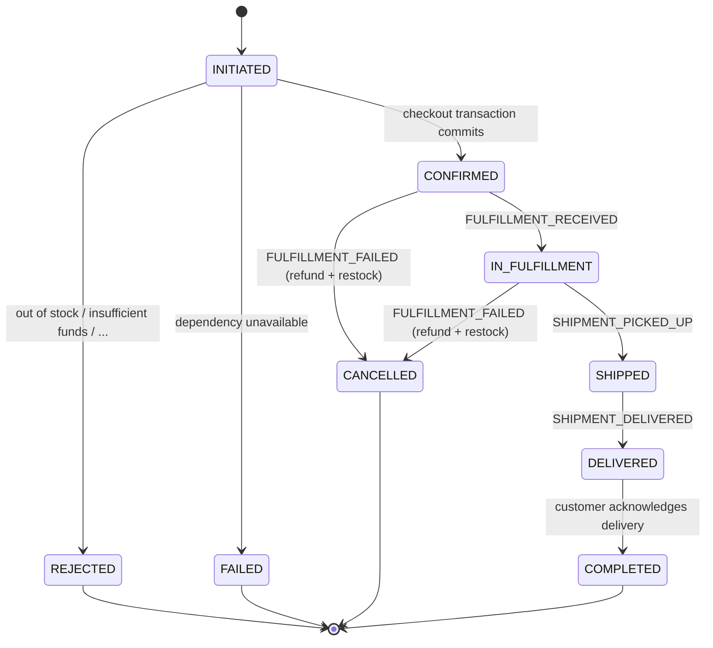

# order_db (order-service)

The checkout bounded context. Orders, inventory, wallets and payments share this database **on purpose**, so that stock check, stock decrement, wallet debit, payment and order confirmation are one local transaction.

Schema: [`sql/01-order_db.sql`](sql/01-order_db.sql)




## Tables

| Table | Purpose | Key rules |
|---|---|---|
| `orders` | One row per order, from `INITIATED` to `COMPLETED` | `idempotency_key` unique (double-click safe); `REJECTED`/`FAILED` must have `rejection_reason` (and only they may); anything past `CONFIRMED` must have `total_amount` + `shipping_address`; `delivery_acknowledged_at` is set exactly when `COMPLETED` |
| `order_items` | Lines of an order | Unique `(order_id, product_id)`; quantity 1–10; `unit_price` filled in at checkout |
| `inventory` | **Authoritative** stock per product | `quantity_on_hand >= 0` (cannot oversell, even with a bug) |
| `stock_movements` | Audit trail of every stock change | Sales are negative and need an order; cancellations/restocks are positive; restocks need `performed_by` (the admin) and no order |
| `customer_wallets` | Simulated payment method | `balance >= 0` (cannot overdraw); created lazily with balance 0 |
| `wallet_transactions` | Wallet ledger | Top-ups need an idempotency key; payments/refunds need an order; at most one `PAYMENT` and one `REFUND` per order |
| `payments` | One payment per order | Unique `order_id`; `refunded_at` set exactly when `REFUNDED` |
| `outbox_event` | Events waiting to be published to Kafka | Partial index on unpublished rows only; `topic` is `order-events` or `inventory-events` |
| `processed_event` | De-duplicates consumed fulfillment/shipping events | |

## Order status lifecycle



## The checkout transaction, as SQL

Everything below runs in **one** `@Transactional` method. Any exception rolls all of it back. `sql/tests/order_db-tests.sql` proves the rollback leaves the first item's stock untouched.

```sql
-- per item, sorted by product_id (consistent lock order → no deadlocks)
UPDATE inventory SET quantity_on_hand = quantity_on_hand - :qty, version = version + 1
 WHERE product_id = :productId AND quantity_on_hand >= :qty;      -- 0 rows → OutOfStockException
INSERT INTO stock_movements (product_id, delta, reason, order_id) VALUES (:productId, -:qty, 'ORDER_CONFIRMED', :orderId);

UPDATE customer_wallets SET balance = balance - :total, version = version + 1
 WHERE user_id = :userId AND balance >= :total;                     -- 0 rows → InsufficientFundsException
INSERT INTO wallet_transactions (user_id, type, amount, order_id) VALUES (:userId, 'PAYMENT', :total, :orderId);
INSERT INTO payments (id, order_id, user_id, amount, status) VALUES (:paymentId, :orderId, :userId, :total, 'CAPTURED');

UPDATE orders SET status = 'CONFIRMED', total_amount = :total, shipping_address = :address WHERE id = :orderId;
INSERT INTO outbox_event ...  -- INVENTORY_RESERVED, PAYMENT_CAPTURED, ORDER_CONFIRMED, INVENTORY_CHANGED x N
```

## Design notes

- **Why inventory and wallets live here:** `@Transactional` only covers one database. Stock, money and the order must share a database to be atomic.
- **No FK from `order_items.product_id` to `inventory`:** the order is saved as `INITIATED` *before* product validation, so an unknown product id must be storable. It is then rejected with `PRODUCT_NOT_FOUND`.
- **`orders.user_id` has no FK:** users live in `user_db` (another service's database).

