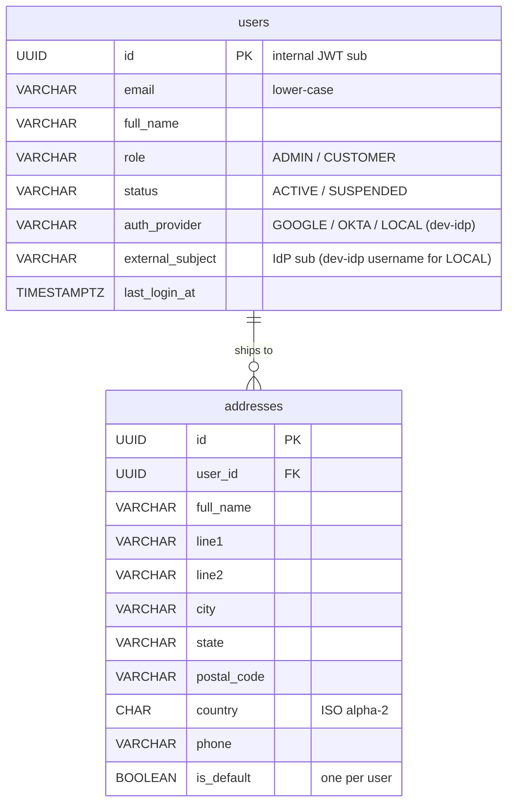

# user_db (user-service)

Users and addresses. Customers register by signing in with Google; admins come from Okta; two local sample users sign in through the dev identity provider (`dev-idp/`) for testing.

Schema: [`sql/02-user_db.sql`](sql/02-user_db.sql)

## Tables

| Table | Purpose | Key rules |
|---|---|---|
| `users` | Everyone who can sign in | `id` is the internal user id: the `sub` of the internal JWT, used everywhere else (`orders.user_id`, ...). `(auth_provider, external_subject)` is unique and is the identity key for **every** user, including the sample users. Google users are always `CUSTOMER`; Okta users are always `ADMIN`. No passwords are stored. Emails are stored lower-case, unique per provider. |
| `addresses` | Shipping addresses | At most one `is_default` per user (partial unique index) |

## Where users come from

| `auth_provider` | Role | Created when | Signs in through |
|---|---|---|---|
| `GOOGLE` | `CUSTOMER` | first Google login (just-in-time registration) | nginx → oauth2-proxy (Google) |
| `OKTA` | `ADMIN` | first Okta login, **only if** the user is in the Okta admin group | nginx → oauth2-proxy (Okta) |
| `LOCAL` | either | seed data only: `sample-customer`, `sample-admin` | the dev identity provider (`dev-idp/`), `local` profile only; through nginx exactly like Google/Okta, or via `dev-idp/dev-token.sh` |

On every sign-in, user-service looks up `(auth_provider, external_subject)`. For Google/Okta, a new identity is created on the spot. For the dev identity provider, nothing is ever created: the username must match a seeded `LOCAL` user, otherwise `403`. It also refreshes `email`/`full_name` from the token and updates `last_login_at`. A `SUSPENDED` user is refused even with a valid Google/Okta login.

## Design notes

- **Why not key users by email?** Emails can change at the identity provider, and the same email can exist at two providers. The provider's `sub` is stable.
- **No passwords at all.** Google and Okta handle credentials, MFA and account recovery. The sample users sign in through the mock dev identity provider, which only asks for a username.
- A new Google customer has **no address** yet, so checkout returns `422 NO_SHIPPING_ADDRESS` until they add one (`PUT /api/users/me/address`).

