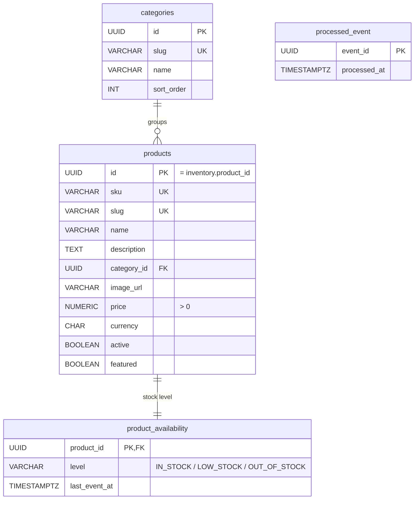

# product_db (product-service)

The public catalog that anyone can browse without logging in.

Schema: [`sql/03-product_db.sql`](sql/03-product_db.sql)

## Tables

| Table | Purpose | Key rules |
|---|---|---|
| `categories` | Store navigation | URL-safe unique `slug` |
| `products` | The public catalog | Unique `sku` and `slug`; `price > 0`; `featured` drives the home page; `created_at` drives "new arrivals" |
| `product_availability` | Stock **level** per product, built from `inventory-events` | Only `IN_STOCK` / `LOW_STOCK` / `OUT_OF_STOCK`, never a count; events older than `last_event_at` are ignored |
| `processed_event` | De-duplicates consumed `inventory-events` | |

## Design notes

- **No stock counts here, on purpose.** Exact stock is in `order_db.inventory`. The storefront only needs a level, and anonymous traffic never touches the checkout database.
- **Eventually consistent:** a level can lag the real stock by a moment. The checkout transaction is the real check, so the worst case is "shown in stock, rejected at checkout with `409`".
- `ix_products_name_lower` supports the simple `q=` search (`lower(name) LIKE 'abc%'`). Full-text search (OpenSearch) is a later phase.

