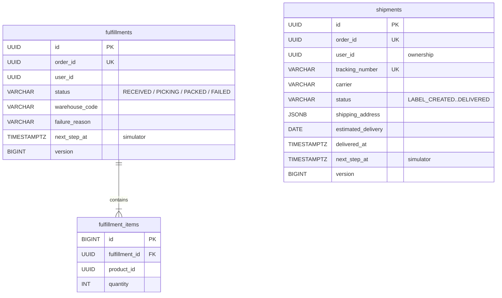
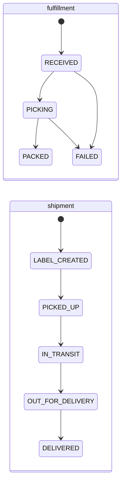

# fulfillment_db and shipping_db

The two event-driven services after checkout. Neither makes synchronous calls; everything they need arrives in events.

Schemas: [`sql/04-fulfillment_db.sql`](sql/04-fulfillment_db.sql), [`sql/05-shipping_db.sql`](sql/05-shipping_db.sql). Both databases also contain `outbox_event` and `processed_event` tables with the same shape as in `order_db` (not drawn).

## Tables

| Table | Purpose | Key rules |
|---|---|---|
| `fulfillments` | One per confirmed order | Unique `order_id` (a redelivered `ORDER_CONFIRMED` can't create a second one); `failure_reason` set exactly when `FAILED`; `next_step_at` tells the simulator when to advance it |
| `fulfillment_items` | What to pick | Unique `(fulfillment_id, product_id)` |
| `shipments` | One per packed order | Unique `order_id` and `tracking_number`; `user_id` copied from the event so customers can only see their own; `delivered_at` set exactly when `DELIVERED` |

## Status flows

