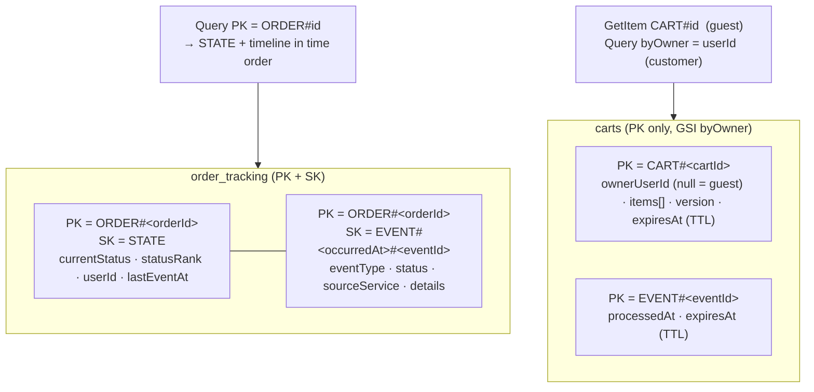

# DynamoDB tables

Two services use DynamoDB instead of Postgres:

| Table | Service | Why DynamoDB |
|---|---|---|
| `order_tracking` | order-tracking-service | Every read is "everything for order X, in time order"; append-heavy; no joins; can be rebuilt by replaying Kafka |
| `carts` | cart-service | Pure key-value by cart id; short-lived (TTL deletes abandoned carts); no relational needs |

Definitions: [`dynamodb/order_tracking.table.json`](dynamodb/order_tracking.table.json), [`dynamodb/carts.table.json`](dynamodb/carts.table.json). Example items: [`dynamodb/sample-items.json`](dynamodb/sample-items.json). Create them with [`dynamodb/create-tables.sh`](dynamodb/create-tables.sh) (the services also create them on startup in the `local`/`docker` profiles).

## `order_tracking` (single-table design)

| Item | PK | SK | Attributes |
|---|---|---|---|
| Current state | `ORDER#<orderId>` | `STATE` | `currentStatus`, `statusRank` (N), `userId`, `lastEventAt`, `updatedAt` |
| Timeline event | `ORDER#<orderId>` | `EVENT#<occurredAt>#<eventId>` | `eventId`, `eventType`, `status`, `sourceService`, `occurredAt`, `receivedAt`, `details` (map) |

- `occurredAt` is fixed-width ISO-8601 UTC with milliseconds (`2026-10-04T18:50:00.123Z`), so string order = time order.
- **Write:** one `TransactWriteItems` with (1) Put the event item with `attribute_not_exists(PK)`, which makes redelivered events no-ops, and (2) Update `STATE` with `attribute_not_exists(statusRank) OR statusRank < :newRank`, so status only moves forward.
- **Read:** `Query PK = ORDER#<id>` returns `STATE` + the whole timeline in one call. `GetItem STATE` (strongly consistent) for "latest".
- **Ownership:** customers may read only items whose `STATE.userId` is their own id.
- **Status ranks** (`statusRank` on `STATE`; the status only moves to a higher rank). The status is the event type:

  | Rank | Event type(s) |
  |---|---|
  | 10 | `ORDER_INITIATED` |
  | 20 | `INVENTORY_RESERVED` |
  | 25 | `PAYMENT_CAPTURED` |
  | 30 | `ORDER_CONFIRMED`, `ORDER_REJECTED`, `ORDER_FAILED` (only one of them ever happens) |
  | 40 / 45 / 50 | `FULFILLMENT_RECEIVED` / `FULFILLMENT_PICKING` / `FULFILLMENT_PACKED` |
  | 55 / 60 / 70 / 75 / 80 | `SHIPMENT_CREATED` / `SHIPMENT_PICKED_UP` / `SHIPMENT_IN_TRANSIT` / `SHIPMENT_OUT_FOR_DELIVERY` / `SHIPMENT_DELIVERED` |
  | 85 | `ORDER_DELIVERED` |
  | 90 / 91 / 92 / 95 | `FULFILLMENT_FAILED` / `INVENTORY_RESTORED` / `PAYMENT_REFUNDED` / `ORDER_CANCELLED` |
  | 100 | `DELIVERY_ACKNOWLEDGED` (the order is `COMPLETED`; highest rank) |

  Source: `StatusRanks` in order-tracking-service. Gaps leave room for new event types.
- **Billing:** on-demand. **TTL:** attribute `expiresAt` defined but unset by default.

## `carts`

| Item | PK | Attributes |
|---|---|---|
| Cart | `CART#<cartId>` | `cartId`, `ownerUserId` (null = guest), `items` (list of `{productId, quantity, addedAt}`), `version` (N), `createdAt`, `updatedAt`, `expiresAt` (TTL) |
| Processed event marker | `EVENT#<eventId>` | `processedAt`, `expiresAt` (7 days) |

- GSI **`byOwner`** (`ownerUserId`) finds a customer's single cart. Guest carts have no `ownerUserId`, so they don't appear in the index (sparse index).
- **TTL:** guest carts expire after 7 days of inactivity, customer carts after 30; every write pushes `expiresAt` forward.
- **Optimistic locking:** every write is conditional on `version`.
- **No prices stored:** only `productId` + `quantity`. Prices are always read live from product-service, so they can't go stale.
- Limits: 50 lines per cart, 10 of each product.
