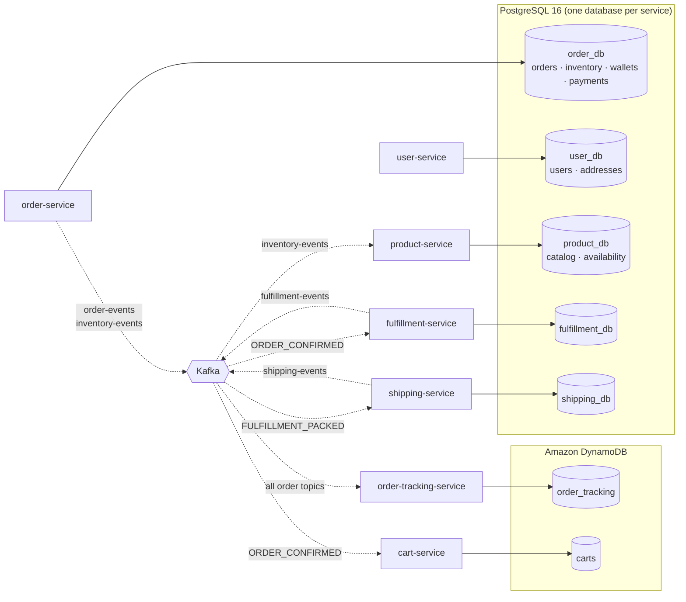

# Data model

The reviewed source of truth for every database in `spring-microservices-demo`. Review it here first; the services copy these scripts into their Flyway migrations when they are implemented (see "How this maps to the code" below).

## What's in this folder

| Path | What it is |
|---|---|
| [`01-order_db.md`](01-order_db.md) | order-service: orders, inventory, wallets, payments (the `@Transactional` checkout) |
| [`02-user_db.md`](02-user_db.md) | user-service: users from Google / Okta / the dev identity provider, addresses |
| [`03-product_db.md`](03-product_db.md) | product-service: categories, products, stock levels read model |
| [`04-fulfillment_shipping_db.md`](04-fulfillment_shipping_db.md) | fulfillment-service and shipping-service |
| [`05-dynamodb.md`](05-dynamodb.md) | order-tracking-service (`order_tracking`) and cart-service (`carts`) |
| `sql/00-create-databases.sql` | creates the 5 Postgres databases and one owner role per service |
| `sql/0N-<db>.sql` | schema per database |
| `sql/seed/` | local sample data (3 categories, 12 products, 2 sample users, 1 wallet) |
| `sql/tests/` | constraint and checkout-rollback tests (run inside a transaction, rolled back) |
| `dynamodb/` | table definitions (AWS CLI JSON), sample items, `create-tables.sh` |
| `diagrams/` | Mermaid sources (`.mmd`) and rendered `.svg` files |
| `scripts/verify-sql.sh` | applies everything to a throwaway Postgres 16 container and runs the tests |

## Big picture





- **Database per service.** No service reads another service's tables. Cross-service references (for example `orders.user_id`) are plain UUID columns without foreign keys, kept consistent by the application and by events.
- **Polyglot persistence.** Postgres wherever constraints and transactions matter. DynamoDB for two key-value / append-heavy stores that can be rebuilt (tracking) or are short-lived (carts).
- **Read models fed by Kafka.** `product_db.product_availability` and DynamoDB `order_tracking` are built from events and never written by an API.

## Conventions

- `UUID` primary keys for anything that crosses a service boundary. `BIGINT` identity keys for child rows that never leave their service (`order_items`, `stock_movements`, ...).
- Money: `NUMERIC(12,2)` + `currency CHAR(3)`. Never floating point.
- Every table has `created_at` / `updated_at` (`TIMESTAMPTZ`). A `set_updated_at()` trigger keeps `updated_at` correct even for native `UPDATE` statements.
- Enum-like columns are `VARCHAR` + `CHECK` (easy to read and easy to extend with a new migration), not Postgres enum types.
- **Invariants live in the database too:** `quantity_on_hand >= 0`, `balance >= 0`, "a rejected order has a reason", "a Google user is always a customer", and similar rules. The application checks them first; the constraints are the last line of defense.
- Optimistic locking: a `version` column on rows that are updated concurrently (`orders`, `inventory`, `customer_wallets`, `fulfillments`, `shipments`).
- Outbox + processed-event tables follow the same shape in every service that publishes or consumes Kafka events.

## Fixed IDs used by the seed data

IDs line up across databases, so the services work together out of the box.

| Thing | ID |
|---|---|
| Sample admin (`admin@demo.local`) | `00000000-0000-4000-8000-0000000000a1` |
| Sample customer (`customer@demo.local`) | `00000000-0000-4000-8000-0000000000c1` |
| Categories | `10000000-0000-4000-8000-00000000000[1-3]` |
| Products / inventory | `20000000-0000-4000-8000-0000000000[01-12]` |
| Customer default address | `30000000-0000-4000-8000-000000000001` |

| # | Product | Category | Price | Stock | Level | Featured |
|---|---|---|---|---|---|---|
| 1 | Wireless Earbuds | Electronics | $79.99 | 40 | IN_STOCK | yes |
| 2 | USB-C Charger 65W | Electronics | $39.99 | 100 | IN_STOCK |  |
| 3 | Mechanical Keyboard | Electronics | $129.00 | 1 | LOW_STOCK | yes |
| 4 | 27" 4K Monitor | Electronics | $349.00 | 0 | OUT_OF_STOCK |  |
| 5 | Pour-Over Coffee Set | Home & Kitchen | $54.50 | 25 | IN_STOCK | yes |
| 6 | Cast Iron Skillet 10" | Home & Kitchen | $34.95 | 60 | IN_STOCK |  |
| 7 | Ceramic Mug Set (4) | Home & Kitchen | $29.00 | 3 | LOW_STOCK |  |
| 8 | Bamboo Cutting Board | Home & Kitchen | $24.99 | 80 | IN_STOCK |  |
| 9 | Insulated Water Bottle 1L | Outdoor | $27.50 | 120 | IN_STOCK | yes |
| 10 | Daypack 25L | Outdoor | $64.00 | 35 | IN_STOCK |  |
| 11 | LED Headlamp | Outdoor | $22.00 | 70 | IN_STOCK |  |
| 12 | Camping Hammock | Outdoor | $45.00 | 18 | IN_STOCK |  |

Demo-relevant stock: **Mechanical Keyboard = 1** (concurrency demo: 10 buyers, 1 winner), **27" 4K Monitor = 0** (sold out → `409`), **Ceramic Mug Set = 3** (low stock badge).

The two sample users use `auth_provider = LOCAL` and sign in through the **dev identity provider** (`../dev-idp/`, `local` profile only): type `sample-customer` or `sample-admin` on its login page, or use `dev-idp/dev-token.sh`. Real users come from Google (customers) and Okta (admins) and are created automatically on their first login.

## How to verify

```bash
./scripts/verify-sql.sh            # needs Docker; prints PASS for every constraint test
./dynamodb/create-tables.sh        # needs the AWS CLI and DynamoDB Local on :8000
```

These scripts were run against PostgreSQL 16 while writing this folder: all schemas and seeds apply cleanly, and all 24 constraint/rollback checks pass (13 in `order_db`, 11 in `user_db`).

## How this maps to the code

| Here | In the service (when implemented) |
|---|---|
| `sql/00-create-databases.sql` | mounted into the Postgres container's `/docker-entrypoint-initdb.d/` |
| `sql/0N-<db>.sql` | `<service>/src/main/resources/db/migration/V1__init.sql` (copied verbatim) |
| `sql/seed/0N-<db>-seed.sql` | `<service>/src/main/resources/db/seed/V2__seed.sql` (`local` profile only) |
| `sql/tests/*.sql` | kept here; the services have their own Testcontainers tests |
| `dynamodb/*.table.json` | the table initializer in order-tracking-service / cart-service creates the same tables |

**Rule:** after a migration is committed, never edit it. Changes go into a new `V<n>__*.sql` in the service **and** are reflected here (schema file + docs + diagram), so this folder stays an accurate picture of the current model.

## Questions for the reviewer

1. Wallet as the payment method: is a simulated wallet fine for the demo, or should a mock card processor be modelled (authorize/capture tables)?
2. `order_items.quantity` is capped at 10 per product, and carts at 10 per product / 50 lines. Are these limits OK?
3. Low-stock threshold is 5 units for every product. Should it be per product (a column on `inventory`)?
4. Addresses: one default per user, with order snapshots stored as JSONB. Do we need multiple saved addresses in the UI?
5. Should soft deletes (`deleted_at`) be added for products instead of `active = false`?
