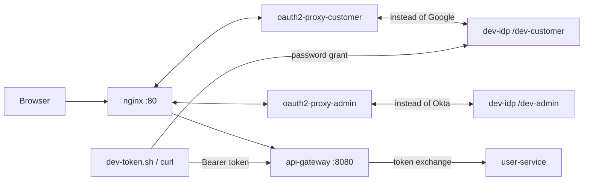

# dev-idp: test sign-in without Google or Okta

A local mock OpenID Connect server ([navikt/mock-oauth2-server](https://github.com/navikt/mock-oauth2-server)) that stands in for **Google** (customers) and **Okta** (admins). The two sample users then sign in through the **real** path: nginx → oauth2-proxy → session cookie → gateway token check → token exchange → services. That lets you test nginx, the gateway's access rules and rate limiting, and the frontend before any Google or Okta account exists.

**Local development only.** The gateway and user-service trust these issuers only in the `local` profile (`CLAUDE.md` 6.11).



## Files

| File | Purpose |
|---|---|
| `dev-idp.json` | the mock server's config: two issuers and the users each one knows |
| `docker-compose.dev-idp.yml` | **override** for `../nginx-proxy/docker-compose.yml`: adds the `dev-idp` container and points both oauth2-proxy instances at it |
| `login.html` | the mock server's login page: one button per sample user, which also sends that user's claims (see below) |
| `dev-token.sh` | prints an access token for a sample user (password grant), for API tests without a browser |

## Sample users

| Sign in as | Issuer (plays) | Token claims | Maps to (user_db) |
|---|---|---|---|
| `sample-customer` | `dev-customer` (Google) | `email=customer@demo.local`, `email_verified=true`, `aud=dev-client` | `…0000000000c1`, `CUSTOMER`, $500 wallet, default address |
| `sample-admin` | `dev-admin` (Okta) | `email=admin@demo.local`, `groups=["smd-admins"]`, `aud=api://default` | `…0000000000a1`, `ADMIN` |
| `sample-not-admin` | `dev-admin` (Okta) | `groups=[]` | none: refused (tests the admin-group rule) |

There's no password: the login page (`login.html`) has one button per sample user. An "advanced" form lets you type any other subject; it gets a token without the mapped claims and is refused (no automatic registration in dev mode).

**Why a custom login page:** the `tokenCallbacks` / `requestMappings` in `dev-idp.json` only match parameters of the *token* request, so they work for `dev-token.sh` (password grant) but not for the browser's authorization-code flow, where the default page sends only a username. Without claims, oauth2-proxy failed with "neither the id_token nor the profileURL set an email". `login.html` (enabled by `loginPagePath`) posts `username` plus the user's `claims` JSON, which the mock server puts into the issued tokens. Keep its claims in sync with `dev-idp.json`.

This is the **only** way to sign in as a sample user; there's no password login. `user_db` stores no passwords, and the sample users are found by `external_subject` = the username above.

## Run it

```bash
cd ../nginx-proxy
docker compose -f docker-compose.yml -f ../dev-idp/docker-compose.dev-idp.yml \
  --profile google --profile okta --profile dev-idp up -d
```

`.env` is optional in this mode: the client ids and secrets are fixed dev values, and the cookie secrets have dev-only defaults. Values in `.env` still win.

**In the browser** (http://localhost):

- **Customer:** "Sign in with Google" → the mock login page (on port 8099) → click `sample-customer` → back in the store, signed in.
- **Admin:** open http://localhost/admin → mock login page → click `sample-admin` → admin UI.
- **Refusal test:** open http://localhost/admin as `sample-not-admin` → oauth2-proxy answers **403** (not in `smd-admins`).
- **Sign out:** `/oauth2/customer/sign_out?rd=/`, `/oauth2/admin/sign_out?rd=/`.

**Without a browser** (gateway directly on :8080):

```bash
TOKEN=$(./dev-token.sh customer)
curl -s -H "Authorization: Bearer $TOKEN" http://localhost:8080/api/orders           # 200
curl -s -H "Authorization: Bearer $TOKEN" http://localhost:8080/api/admin/orders     # 403 (customer)

ADMIN=$(./dev-token.sh admin)
curl -s -H "Authorization: Bearer $ADMIN" http://localhost:8080/api/admin/orders     # 200

# rate limiting is keyed by user: hammer one endpoint and expect some 429s
for i in $(seq 1 100); do curl -s -o /dev/null -w '%{http_code}\n' \
  -H "Authorization: Bearer $TOKEN" http://localhost:8080/api/orders; done | sort | uniq -c
```

## How it plugs in

- **nginx and the frontend:** no change. They use the same `/oauth2/customer/*` and `/oauth2/admin/*` paths as with Google and Okta.
- **oauth2-proxy:** the override replaces each proxy's `command`. The admin proxy also gets `--oidc-extra-audience=api://default`, because the dev admin's ID token carries `aud=api://default` (Okta's real ID token has the client id). The browser reaches the mock server at `http://localhost:8099`, while oauth2-proxy reaches it at `http://dev-idp:8080` inside Docker. So discovery is skipped and the URLs are given explicitly (`--login-url` for the browser; `--redeem-url` / `--oidc-jwks-url` internal). Tokens are minted on the internal call, so their `iss` is `http://dev-idp:8080/<issuer>`.
- **Gateway** (`application-local.yml`, spec in `CLAUDE.md` 6.11). The issuer string and the key URL are set separately for the same reason:
  ```yaml
  security:
    dev-issuers:
      - issuer: http://dev-idp:8080/dev-customer
        jwk-set-uri: http://localhost:8099/dev-customer/jwks   # gateway runs on your machine
        audience: dev-client
        role: CUSTOMER
      - issuer: http://dev-idp:8080/dev-admin
        jwk-set-uri: http://localhost:8099/dev-admin/jwks
        audience: api://default
        role: ADMIN
        required-group: smd-admins
  ```
  If the gateway runs in Docker, use `http://dev-idp:8080/...` for `jwk-set-uri`. Startup must fail if `security.dev-issuers` is set outside the `local` profile.
- **user-service:** the same `dev-issuers` config. A dev token maps to the seeded `LOCAL` user whose `external_subject` equals the token's `sub` (`sample-customer` / `sample-admin`).

> **Token issuer when calling with `dev-token.sh`:** that script requests tokens from `localhost:8099`, so their `iss` is `http://localhost:8099/<issuer>`, not `http://dev-idp:8080/<issuer>`. To accept both, list each dev issuer under both addresses in the gateway and user-service config (same `jwk-set-uri`, audience and role).

## Verification log

All three have been checked: items 2 and 3 on 2026-10-05 (phase 11), item 1 on 2026-10-05 (phase 13).

1. **The internal/browser URL split.** ✅ Sign-in completes through nginx for `sample-customer` and `sample-admin`, and oauth2-proxy accepts `iss = http://dev-idp:8080/<issuer>`. It needed `login.html` and the admin's extra audience (above). `sample-not-admin` gets oauth2-proxy's 403 at `/oauth2/admin/callback`.
2. **The password grant** matches users via `requestParam: "username"`. ✅ `dev-token.sh customer|admin|not-admin` return tokens with the mapped claims (`iss = http://localhost:8099/<issuer>`).
3. **Admin access token:** `groups` and `aud=api://default` are present in it, not just in the ID token. ✅ `groups: ["smd-admins"]` and `aud: api://default` (and `groups: []` for `sample-not-admin`). user-service exchanged them: `sample-customer` → `…c1` CUSTOMER, `sample-admin` → `…a1` ADMIN, `sample-not-admin` → 403.

> **Image version:** pinned to `3.0.3` (the spec said 3.1, but there is no 3.1.x on ghcr.io; the 3.x line ends at `3.0.3`). That's the version checked above. Override with `DEV_IDP_VERSION`.

If any of these fail, fix it here, then update this README and `CLAUDE.md` 6.11.

## Ports

| Port | What |
|---|---|
| 8099 | dev-idp (8090 is Kafka UI) |
| 80 | nginx |
| 8080 | api-gateway |
