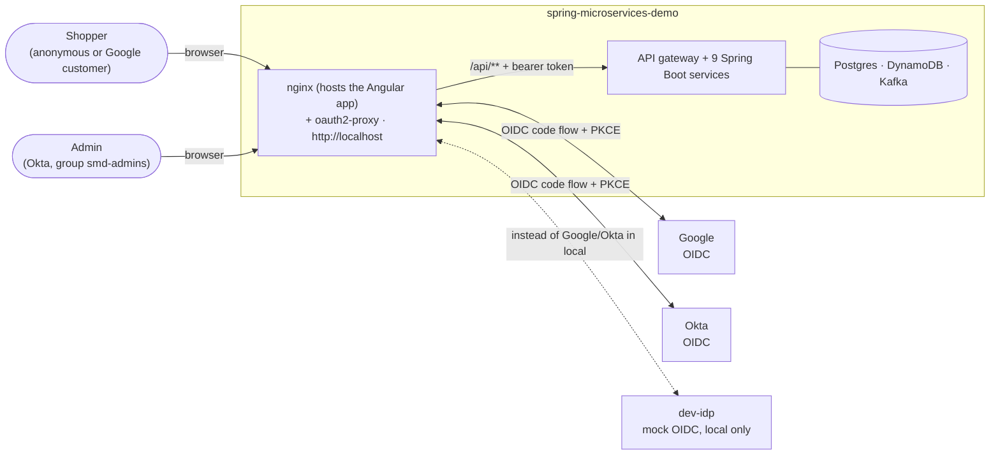
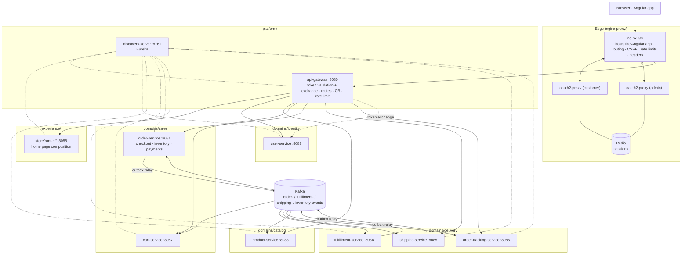
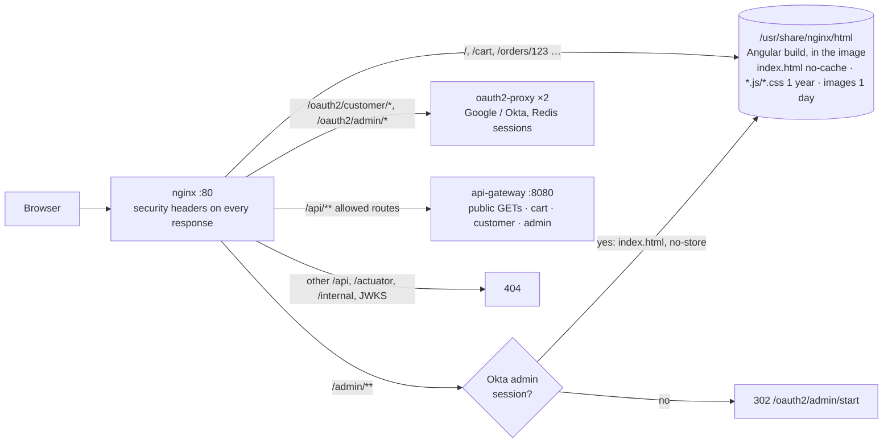
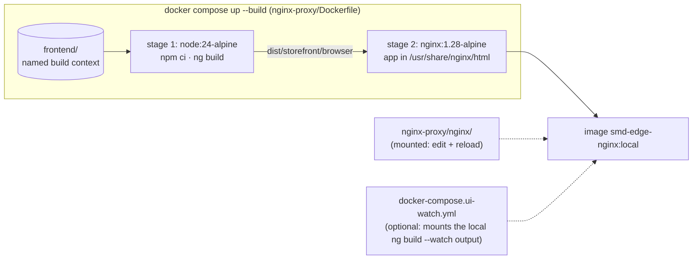
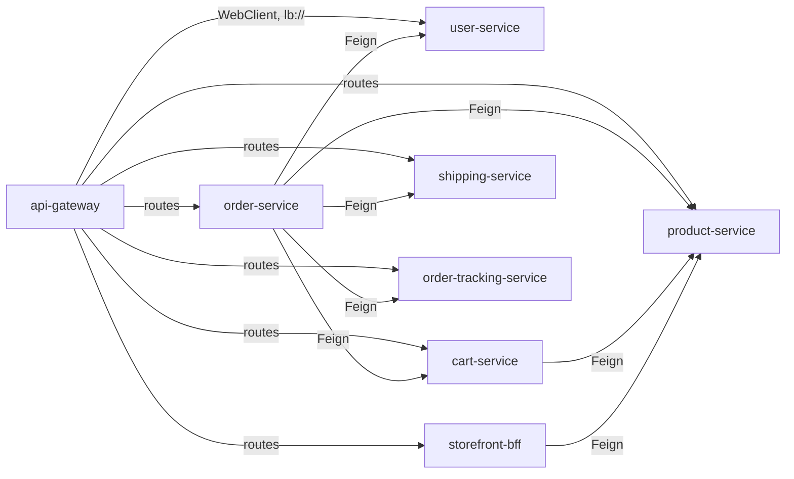
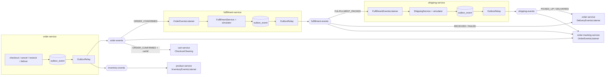
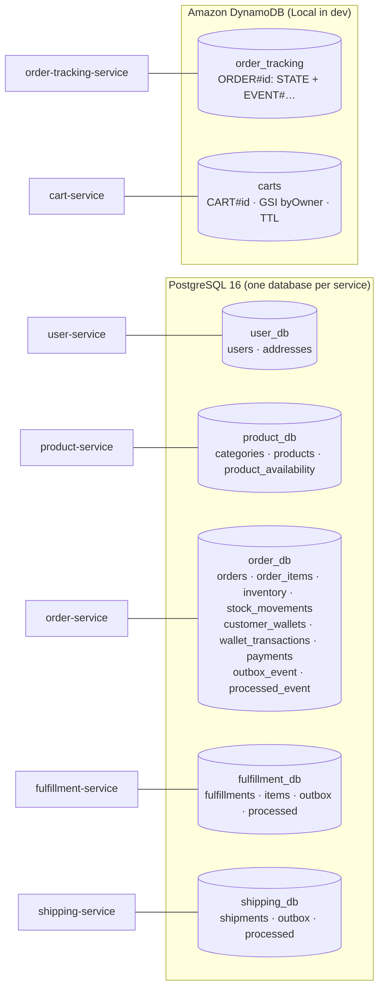
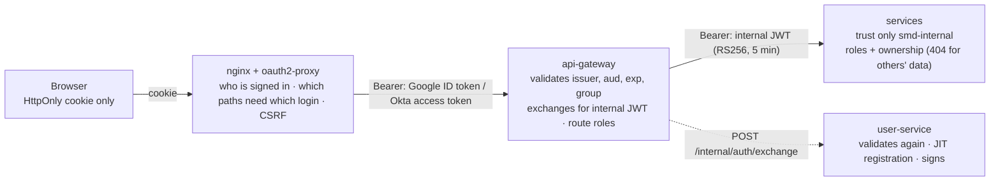
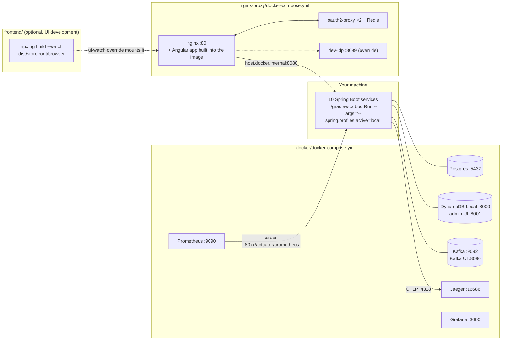

# System architecture

How the pieces of `spring-microservices-demo` fit together: who talks to whom, who owns which data, and why the boundaries are where they are. For the step-by-step flows, see [sequence-diagrams.md](sequence-diagrams.md). The rules every piece follows are in [`CLAUDE.md`](../CLAUDE.md).

- [1. Context](#1-context)
- [2. Services and infrastructure](#2-services-and-infrastructure)
- [3. Synchronous calls (HTTP / Feign)](#3-synchronous-calls-http--feign)
- [4. Asynchronous flow (Kafka)](#4-asynchronous-flow-kafka)
- [5. Data ownership (polyglot persistence)](#5-data-ownership-polyglot-persistence)
- [6. Security layers](#6-security-layers)
- [7. Resilience map](#7-resilience-map)
- [8. Observability](#8-observability)
- [9. Runtime view (local)](#9-runtime-view-local)
- [10. Key decisions and trade-offs](#10-key-decisions-and-trade-offs)

## 1. Context

- The **browser** only talks to nginx on port 80: the Angular app (built into the nginx image), the API and the login flows all share one origin.
- **Google** signs in customers and registers them on first sign-in. **Okta** signs in admins.
- In `local`, the **dev-idp** mock server stands in for both, so the sample users go through exactly the same path.

## 2. Services and infrastructure

| Group | Service | Owns | Talks to |
|---|---|---|---|
| edge | nginx (+ the Angular build) + oauth2-proxy | the UI files (in its image), sessions (Redis) | gateway, oauth2-proxy |
| platform | api-gateway | — | every exposed service (`lb://`), user-service (token exchange) |
| platform | discovery-server | the registry | — |
| experience | storefront-bff | nothing (composes) | product-service |
| identity | user-service | users, addresses, the internal signing key | — |
| catalog | product-service | categories, products, prices, availability levels | consumes `inventory-events` |
| sales | cart-service | carts (DynamoDB) | product-service; consumes `order-events` |
| sales | order-service | orders, **inventory, wallets, payments**, outbox | user-, product-, cart-, shipping-, tracking-service; produces `order-events`, `inventory-events`; consumes fulfillment/shipping events |
| delivery | fulfillment-service | fulfillments, outbox | consumes `order-events`; produces `fulfillment-events` |
| delivery | shipping-service | shipments, outbox | consumes `fulfillment-events`; produces `shipping-events` |
| delivery | order-tracking-service | the tracking read model (DynamoDB) | consumes all order topics; **no synchronous calls** |

**Why these groups:**
- `platform/` is how the system runs.
- `experience/` shapes data for one UI and owns nothing.
- `domains/` follows data ownership: `sales` produces orders, `delivery` reacts to them over Kafka, and `catalog` and `identity` are read by everyone.

Calls go *between* groups in that direction.

### The edge: one nginx for the UI, the API and sign-in

There is a single nginx container. Its image (`nginx-proxy/Dockerfile`) **builds the Angular app and hosts it**, and the same nginx fronts the API and the login flows. The routing rules live in `nginx-proxy/nginx/templates/default.conf.template`.

- **No separate UI container or UI server:** the same process serves the files and proxies `/api`.
- **The config is mounted**, so config changes only need `nginx -s reload`. App changes need `docker compose up -d --build nginx`.
- **During UI development** the watch override serves the local build instead, still through nginx, so sign-in works.

## 3. Synchronous calls (HTTP / Feign)

- **All service-to-service calls are OpenFeign** (`feign-hc5`), resolved by service name through Eureka and Spring Cloud LoadBalancer. No client has a URL or port.
- Each caller keeps one package per downstream service, `client/<service>/`, holding:
  - `XxxClient`: the Feign interface;
  - `XxxDto`: the downstream service's response shapes;
  - `XxxErrorDecoder`: `404` → not found, other `4xx` → not retried, `5xx`/IO → retryable;
  - `XxxAdapter`: Resilience4j plus mapping to domain types. The rest of the code only sees the adapter.
- **fulfillment-service and shipping-service make no synchronous calls**: everything they need arrives in events. **order-tracking-service** makes none either, which is the point of a read model.
- **Not exposed through the gateway:** fulfillment-service (internal only), every `/internal/**` endpoint (token exchange, chaos toggles), JWKS, and every actuator endpoint except health.
- **Parallel fan-out:** order-service (checkout lookups, order details) and storefront-bff (home page) run their Feign calls on a bounded, named, context-propagating executor through `ParallelCalls`. Java 17 has no virtual threads, so it's `CompletableFuture` plus a `ThreadPoolTaskExecutor`.

## 4. Asynchronous flow (Kafka)

- **Checkout is not on Kafka.** It needs an immediate answer and an ACID guarantee, so it's one local transaction (see [sequence-diagrams.md §3](sequence-diagrams.md#3-checkout-success)). Kafka connects everything *after* checkout.
- **Transactional outbox** in every producer:
  - the event row commits with the business change;
  - `OutboxRelay` publishes rows in order (`FOR UPDATE SKIP LOCKED`, stopping at the first failure);
  - delivery is at least once.
- **Keys:** the order id on order topics (one order → one partition → ordered), the product id on `inventory-events`.
- **Consumers:**
  - idempotent: `processed_event` in the same transaction, or DynamoDB conditional writes in tracking;
  - unknown event types are skipped;
  - failures get 3 attempts with backoff, then go to `<topic>.DLT`.
- The contract is [events.md](events.md). Each service has its own copy of the event classes; there is no shared library, on purpose.

## 5. Data ownership (polyglot persistence)

- **One database per service.** No service reads another service's tables.
- **Postgres where ACID matters.** Checkout relies on relational constraints and one `@Transactional` method. `quantity_on_hand >= 0` and `balance >= 0` are `CHECK` constraints: the last line of defense against overselling and overdrawing.
- **DynamoDB for key-based, append-heavy data:**
  - **Tracking:** always read by order id, written once per event, no joins. It can be rebuilt by replaying the topics with a new consumer group.
  - **Carts:** key-value by cart id, short-lived (TTL), optimistic locking on `version`.
- The reviewed schemas, seeds and diagrams are in [`data-model/`](../data-model/README.md). Migrations copy them verbatim.

**Why inventory and payment live in order-service:** `@Transactional` covers one database. To make "enough stock → decrement stock → take payment → confirm order" truly atomic, those tables share `order_db`, forming one bounded context, *checkout*. Payment is an internal wallet that can join the transaction. A real card processor is an external system that can't: it would need authorize → capture, with a compensating refund.

## 6. Security layers

| Layer | Enforces | Where |
|---|---|---|
| Edge | sessions (PKCE, Redis), per-path login, CSRF (`X-Requested-With`), rate limits per IP, security headers, blocked internal paths | `nginx-proxy/nginx/templates/default.conf.template` |
| Gateway | trusted issuers only (Google, Okta, dev-idp in `local`), audience, `email_verified`, admin group; exchange for an internal JWT, cached; route rules; rate limit per user | `api-gateway` `security/`, `exchange/` |
| Services | internal issuer only, `@PreAuthorize` roles, ownership by JWT `sub` | each service's `security/SecurityConfig`, `CurrentUser` |

Services never see a Google or Okta token. Details: [security.md](security.md).

## 7. Resilience map

| Where | Mechanism | Config |
|---|---|---|
| Every Feign call | connect/read timeouts per client; Resilience4j **Retry** (GETs only, retryable errors only, backoff + jitter) → **CircuitBreaker** → **Bulkhead** on the adapter | `spring.cloud.openfeign.client.config.*`, `resilience4j.*` in each caller's `application.yml` |
| Fan-outs | overall deadline per future (`orTimeout`); bounded executor with `CallerRunsPolicy` back-pressure | `composition.*`, `CompositionExecutorConfig` |
| Aggregators | fallback = "section unavailable": `degraded: true` plus `unavailableSections`, never a 500 | `OrderDetailsService`, `StorefrontService`, `CartService` |
| Checkout lookups | **no** fallback: they must fail (`422` / `503`), and the order is recorded as REJECTED/FAILED | `PlaceOrderUseCase` |
| Gateway routes | per-route circuit breaker with a `503` ProblemDetail fallback; connect/response timeouts; bulkhead; in-memory rate limits | `api-gateway` `application.yml`, `fallback/`, `ratelimit/` |
| Kafka consumers | `DefaultErrorHandler` (3 attempts, exponential backoff) → `DeadLetterPublishingRecoverer` to `<topic>.DLT`; deserialization errors go straight to the DLT | each `KafkaConsumerConfig` |
| Edge | per-IP rate limits (`catalog`, `api`, `login` zones) | `nginx-proxy/nginx/nginx.conf` |
| Demo toggles | `POST /internal/chaos` on user- and product-service (`local` only): latency, failure rate | `chaos/` |

## 8. Observability

- **One order, one trace** across HTTP and Kafka. The outbox stores the `traceparent`, and the relay continues it.
- **Logs** carry `[application, traceId, spanId, correlationId, orderId]`: readable text in `local`, ECS JSON elsewhere.
- **Prometheus** scrapes every service. Grafana has one dashboard.
- **Readiness** includes the database or DynamoDB table and Kafka.

Details and how to use it: [observability.md](observability.md).

## 9. Runtime view (local)

The start order and commands are in the [README](../README.md#build-deploy-and-test). The `docker` profile switches hostnames to container names for a fully containerized run.

## 10. Key decisions and trade-offs

| Decision | Why | Cost |
|---|---|---|
| Inventory + wallet + payment in **one service and one database** | real ACID checkout with `@Transactional`; no saga needed during checkout | a bigger "checkout" bounded context; a real card processor would need authorize/capture + refund |
| **Kafka only after checkout** | the customer gets a final answer immediately; async work can't lose a confirmed order (outbox) | everything after checkout is eventually consistent (tracking, availability, cart clearing) |
| **Transactional outbox** + polling relay | no dual write; ordering per order | a few hundred ms of latency; at-least-once delivery, so consumers must be idempotent |
| **Choreography** saga (one compensation) | services react to events; no coordinator to build or run | the flow is spread over services: tracking and traces are how you see it |
| **DynamoDB** for tracking and carts | access by key, append-heavy, TTL, rebuildable from Kafka | no ad-hoc queries; admin listings come from Postgres, never a `Scan` |
| **Availability levels via Kafka** (CQRS) | anonymous catalog traffic never reaches order-service; cacheable | can lag a moment; the checkout transaction is the authoritative stock check (worst case: `409`) |
| **Token exchange** at the gateway | services trust one internal issuer; Google/Okta tokens stay at the edge | an extra hop per few minutes per user (cached) |
| **Blocking Feign + `CompletableFuture`** on Java 17 | simple, debuggable code; parallel where it matters | threads per call; Java 21 virtual threads would be the cheaper alternative |
| **Angular app built into the edge nginx image** | one container serves the UI and fronts the API and sign-in; same origin, no CORS; nothing to deploy separately | a UI change means rebuilding the nginx image (or the watch override during development) |
| **No shared DTO library** | services stay independently deployable | duplicated event and DTO classes; [events.md](events.md) is the contract |
