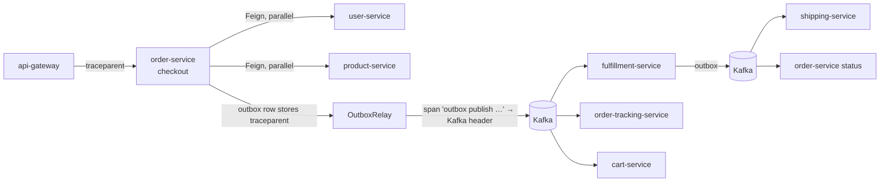

# Observability

Traces, metrics and logs for every service (CLAUDE.md 6.10). The infrastructure is in `docker/docker-compose.yml`:

| Tool | URL | What |
|---|---|---|
| Jaeger | http://localhost:16686 | traces (OTLP over HTTP on 4318) |
| Prometheus | http://localhost:9090 | scrapes every service's `/actuator/prometheus` every 15 s (`docker/prometheus/prometheus.yml`) |
| Grafana | http://localhost:3000 (user `admin`, password `GRAFANA_ADMIN_PASSWORD`, default `admin`; an existing `grafana-data` volume keeps the password it was first given) | dashboard **spring-microservices-demo** (`docker/grafana/provisioning/dashboards/smd-overview.json`), with Prometheus and Jaeger data sources |

## Traces: one order, one trace



- **HTTP**: the gateway, every service and every Feign call (`feign-micrometer`) propagate the W3C `traceparent` automatically. The `CompletableFuture` fan-outs keep the trace on their worker threads (`ContextPropagatingTaskDecorator` in each `CompositionExecutorConfig`).
- **Kafka**: `spring.kafka.template.observation-enabled` and `spring.kafka.listener.observation-enabled` are on. The producer writes `traceparent` into the record headers, and every listener continues it.
- **The outbox gap, closed** (`outbox/OutboxTracing` in order-, fulfillment- and shipping-service):
  - Business code writes an event into `outbox_event`; the relay sends it later, from a scheduler thread that knows nothing about the request.
  - So `OutboxWriter` stores the current `traceparent` in `outbox_event.trace_parent`.
  - `OutboxRelay` re-opens a span with that parent (`outbox publish <EVENT_TYPE>`) around the Kafka send.
  - Work started by a `@Scheduled` simulator has no span of its own. In that case the writer reuses the trace of the order's latest event, so an order's whole life (checkout → fulfillment → shipping → delivery → tracking) is **one trace**.
  - Tested in `order-service` `OutboxTracingTest`. That test is annotated `@AutoConfigureObservability`: `@SpringBootTest` leaves out the tracing observation handlers by default, and without them the Kafka producer wouldn't write `traceparent` into the headers.
- **What's left out on purpose** (`observability/ObservabilityConfig` in each service, and `management.observations.enable.*`):
  - Prometheus scrapes and health checks (`/actuator/**`)
  - Eureka registry traffic (`/eureka/**`)
  - the Spring Security filter chain
  - `@Scheduled` polling (outbox relays, simulators)

  At 100% sampling, these would bury the real requests.
- **Sampling**: 100% in the `local` profile, 10% otherwise (`TRACING_SAMPLING_PROBABILITY`). Export goes to `OTLP_TRACING_ENDPOINT`, by default `http://localhost:4318/v1/traces` (in `docker`: `http://jaeger:4318/v1/traces`). Tests create spans but never export them (`java-conventions.gradle`).

**Verified in phase 15:** one checkout through the gateway produced **one trace with 74 spans across 8 services over about 14 s**. It covers the gateway, the checkout and its parallel user and product calls, `outbox publish …` spans with Kafka send and receive, fulfillment's simulated steps, shipping's, and finally `ORDER_DELIVERED` reaching tracking, fulfillment and cart.

**Try it:** place an order (through http://localhost, or `dev-idp/dev-token.sh` + `POST /api/orders/checkout` on :8080). Then in Jaeger, pick service `order-service` and operation `http post /api/orders/checkout`, or search by the tag `outbox.event_type=ORDER_CONFIRMED`. The trace shows:
- the checkout and its parallel user/product calls;
- the `outbox publish …` spans;
- then fulfillment, shipping, order-service's status updates, cart clearing and every tracking write, as the simulators move the order along.

## Logs

Every line carries `[application,traceId,spanId,correlationId,orderId]` (`logging.pattern.correlation`):

```
2026-10-05T13:40:12.345Z  INFO 4242 --- [nio-8081-exec-3] [order-service,6f1c…,9a2b…,3c9e…,30ee8ae7-…] c.s.o.checkout.PlaceOrderUseCase : …
```

- **traceId / spanId**: from Micrometer Tracing. Copy a trace id from a log line into Jaeger's search.
- **correlationId**: nginx (or the gateway) sets `X-Correlation-Id`. Each service's `CorrelationIdFilter` puts it into the MDC. Feign interceptors pass it on (order-service, cart-service, storefront-bff), and the composition executors copy it to their worker threads. It belongs to the synchronous request. Asynchronous work after the outbox is linked by the trace id instead, because the outbox carries the `traceparent`, not the correlation id.
- **orderId**: set during checkout (`PlaceOrderUseCase`) and, for every Kafka record on the order topics, from the record key (`OrderIdLogContext`, a `RecordInterceptor` in each consuming service).
- **Format**: readable text in `local`. Everywhere else it's structured JSON (`logging.structured.format.console: ecs`, Elastic Common Schema), with the MDC fields as JSON fields.

## Metrics

All services expose `/actuator/prometheus` (`health`, `info`, `metrics`, `prometheus` only, outside `local`). Every series has an `application` tag. HTTP server latency has histograms (p95/p99).

| Metric | Where | Meaning |
|---|---|---|
| `checkout.attempts{outcome}` | order-service | confirmed, out_of_stock, insufficient_funds, user_inactive, product_not_found, no_shipping_address, empty_cart, dependency_unavailable, invalid_request, error |
| `checkout.duration{outcome}` | order-service | the whole checkout (histogram) |
| `composition.duration{degraded}` | order-service | the details aggregator's fan-out |
| `order.cancellations` | order-service | compensations (fulfillment failed → refund + restock) |
| `outbox.pending`, `outbox.publish.failures` | order-, fulfillment-, shipping-service | unpublished rows; failed sends |
| `tracking.dynamodb.write{outcome}` | order-tracking-service | written / duplicate / stale / error |
| `resilience4j_circuitbreaker_*` | order-service, cart-service, storefront-bff, api-gateway | state, failure rate, calls |
| `kafka_consumer_fetch_manager_records_lag_max` | every Kafka consumer | consumer lag (Kafka client metrics, registered by Spring Boot) |

The Grafana dashboard has one row each for HTTP (rate, p95/p99, 5xx share, filterable by service), checkout, resilience (open circuit breakers, failure rates), and events (outbox pending and failures, consumer lag, tracking writes, failing listener calls).

## Health

`/actuator/health/liveness` and `/actuator/health/readiness` are on in every service. Readiness includes what an instance needs to serve traffic:
- `db` for the Postgres services;
- the DynamoDB table check (`trackingTable`, `cartsTable`);
- `kafka` for every Kafka service: a `KafkaHealthIndicator` asks the broker for its cluster id, because Spring Boot has none.

Circuit-breaker states show up in `/actuator/health` (with details in `local`) but never mark a service DOWN (`allow-health-indicator-to-fail: false`).
