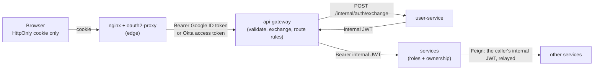
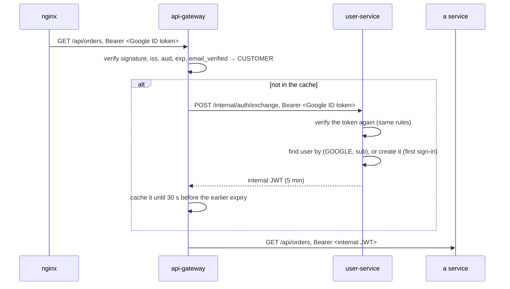

# Security

How sign-in, tokens, roles and ownership work across the system (spec: `CLAUDE.md` 6.11). Three layers, each enforcing on its own, so a mistake in one is caught by the next.



| Layer | Where | Decides |
|---|---|---|
| 1. Edge | `nginx-proxy/` (nginx + two oauth2-proxy instances) | Who is signed in, which paths need which login, CSRF, per-IP rate limits. The browser never holds a token. |
| 2. Gateway | `platform/api-gateway` | Is the external token valid? Swap it for an internal JWT. Which role may call which route. |
| 3. Services | every service's `security/SecurityConfig` | Trust only internal JWTs; check roles (`@PreAuthorize`) and ownership (`CurrentUser`). |

## Roles

| Who | How they sign in | May |
|---|---|---|
| Anyone | not signed in | browse categories and products, use a guest cart |
| `CUSTOMER` | **Google**. The first sign-in registers them (just in time). | place orders (paying from their wallet); see and track **their own** orders, shipments, payments; top up their wallet; manage their address; acknowledge delivery |
| `ADMIN` | **Okta**, and must be in the group **`smd-admins`** | restock products; see and track **all** orders, shipments and payments. Admins don't place orders. |

## Identity providers

| Issuer | `iss` | Audience | Extra checks | Role |
|---|---|---|---|---|
| Google | `https://accounts.google.com` | the Google client id (`GOOGLE_CLIENT_ID`) | `email_verified == true` (else 401) | `CUSTOMER` |
| Okta | `https://<OKTA_DOMAIN>/oauth2/default` (`OKTA_ISSUER_URI`) | `api://default` | `groups` contains `smd-admins`; without it the token is valid but grants no role (403 everywhere) | `ADMIN` |
| dev-customer (`local` only) | `http://dev-idp:8080/dev-customer` and `http://localhost:8099/dev-customer` | `dev-client` | `email_verified == true` | `CUSTOMER` |
| dev-admin (`local` only) | `http://dev-idp:8080/dev-admin` and `http://localhost:8099/dev-admin` | `api://default` | `groups` contains `smd-admins` | `ADMIN` |

Every token is checked for signature (the issuer's JWKS), `iss`, `aud` and `exp` (60 s clock skew). Tokens from any other issuer are rejected with 401, **including the internal issuer `smd-internal`**: an internal token must never come from outside.

The dev issuers (mock OIDC server in `dev-idp/`) are configured in `security.dev-issuers` in `application-local.yml` of the gateway and user-service. **Both refuse to start if it is set outside the `local` profile** (`DevIssuersGuard`).

Setup: Google in `nginx-proxy/README.md`, Okta in `okta-login-setup/README.md`, the dev identity provider in `dev-idp/README.md`.

## Token exchange



- **user-service validates the external token itself**, with the same rules as the gateway. Nobody gets an internal token without a real Google / Okta / dev-idp token, even by reaching user-service directly.
- **Registration:** the first Google sign-in creates a `CUSTOMER`; the first Okta sign-in creates an `ADMIN` (403 without the admin group). Concurrent first logins race on the unique `(auth_provider, external_subject)`; the loser re-reads the winner's row.
- **dev-idp sign-ins never create users:** they map to the seeded `LOCAL` user whose `external_subject` equals the token's `sub`. Unknown dev users, a missing group or the wrong role → 403.
- Every sign-in refreshes `email` (lower-cased) and `full_name`, and sets `last_login_at`. A `SUSPENDED` user → 403.
- The gateway caches the internal token by SHA-256 of the external token: one exchange every few minutes per user. user-service down → 503; refused → 403.
- **Services never see a Google or Okta token.**

### The internal JWT

| Claim | Value |
|---|---|
| `iss` / `aud` | `smd-internal` / `smd-api` |
| `sub` | the internal user id (`users.id`), used as `user_id` everywhere |
| `email`, `name` | from the identity provider |
| `roles` | `["CUSTOMER"]` or `["ADMIN"]` → authority `ROLE_…` |
| `idp` | `google`, `okta` or `dev` |
| `jti`, `iat`, `exp` | unique id; lifetime **5 minutes** |

RS256, signed by user-service. The public key is at `GET /.well-known/jwks.json` (internal only); services fetch it by service name through Eureka. The key pair is created by `./scripts/generate-dev-keys.sh` in `.local/keys/` (git-ignored). **Never commit a private key.** Tests generate keys in memory.

## Gateway route rules

Most specific first; anything not listed is **denied** (401 anonymous, 403 signed in). On every route, a bearer token that is present must be valid (401 otherwise). 401 and 403 are RFC 7807 ProblemDetail; a 401 carries `loginUrl` (`/oauth2/admin/start` on admin paths, `/oauth2/customer/start` elsewhere).

| Path | Method | Access |
|---|---|---|
| `/actuator/health`, `/actuator/prometheus` | GET | public (nginx blocks `/actuator` from outside) |
| `/api/products/**`, `/api/categories/**`, `/api/storefront/**` | GET | public |
| `/api/cart/**` | any | public at the gateway; cart-service decides (guest by `X-Cart-Id`, customer by JWT) |
| `/api/admin/**` | any | `ADMIN` |
| `/api/orders/**`, `/api/wallet/**`, `/api/tracking/**`, `/api/shipments/**` | as per endpoint | `CUSTOMER` (ownership checked in the service) |
| `/api/users/me/**` | GET, PUT | `CUSTOMER` |

The gateway is stateless and has no CSRF protection of its own: it only sees bearer tokens, and CSRF is enforced at nginx (state-changing calls need `X-Requested-With: XMLHttpRequest`). CORS: none needed through nginx (same origin); `http://localhost:4200` is allowed in `local` for the Angular dev server.

## Endpoints by role

Someone else's resource is always **404, never 403**, so ids can't be probed. "Owner or ADMIN" endpoints are called by other services with the caller's relayed token.

| Service | Endpoint | Who |
|---|---|---|
| user-service | `POST /internal/auth/exchange` | internal (gateway); validates the external token itself |
| user-service | `GET /.well-known/jwks.json` | internal |
| user-service | `GET /api/users/me`, `PUT /api/users/me/address` | `CUSTOMER` |
| user-service | `GET /api/admin/me` | `ADMIN` |
| user-service | `GET /api/users/{id}` | owner or `ADMIN` (internal, via Feign) |
| product-service | `GET /api/products…`, `GET /api/categories` | public |
| order-service | `POST /api/orders` (and `POST /api/orders/checkout`, phase 12) | `CUSTOMER` |
| order-service | `GET /api/orders`, `GET /api/orders/{id}`, `GET /api/orders/{id}/details` | `CUSTOMER`, own orders |
| order-service | `POST /api/orders/{id}/acknowledge-delivery` | `CUSTOMER`, own order, once `DELIVERED` (else 409) |
| order-service | `GET /api/wallet`, `POST /api/wallet/top-ups` | `CUSTOMER`, own wallet (`Idempotency-Key`, amount ≤ 1000.00) |
| order-service | `GET /api/admin/orders`, `/api/admin/orders/{id}`, `/api/admin/orders/{id}/details` | `ADMIN` |
| order-service | `GET /api/admin/payments`, `GET /api/admin/inventory`, `POST /api/admin/inventory/{productId}/restock` | `ADMIN` |
| shipping-service | `GET /api/shipments/by-order/{orderId}` | owner or `ADMIN` |
| shipping-service | `GET /api/admin/shipments`, `GET /api/admin/shipments/{trackingNumber}` | `ADMIN` |
| order-tracking-service | `GET /api/tracking/orders/{orderId}`, `…/latest` | owner (`STATE.userId`) or `ADMIN` |
| order-tracking-service | `GET /api/admin/tracking/orders/{orderId}` | `ADMIN` |
| every service | `/actuator/health`, `/actuator/prometheus` | public; `/internal/chaos` only in `local` (user-, product-service) |

"Track all orders" for admins = `GET /api/admin/orders` (Postgres, indexed) + `GET /api/admin/tracking/orders/{id}` (one timeline). There is no DynamoDB `Scan` to list orders.

**Inside the services:** each has its own small `SecurityConfig` (no shared library): resource server, `smd-internal` / `smd-api` only, `roles` → `ROLE_…`, `@EnableMethodSecurity`, stateless. `CurrentUser` gives the caller's id (`sub`) and role. order-service relays the caller's token on every Feign call (`FeignHeadersInterceptor`), including from the parallel `compose-` threads: the security context travels with the task (`ContextPropagatingTaskDecorator` + Spring Security's own `SecurityContextHolderThreadLocalAccessor`). Kafka consumers run without a user; ownership travels in the event envelope (`userId`).

## Sample users (local only)

No passwords exist anywhere: everyone signs in through an identity provider. Locally, the dev identity provider's login page asks only for a username.

| Sign in as (dev-idp) | Plays | Maps to | Notes |
|---|---|---|---|
| `sample-customer` | a Google customer | `customer@demo.local`, id `…0000000000c1`, `CUSTOMER` | default address, wallet 500.00 USD |
| `sample-admin` | an Okta admin in `smd-admins` | `admin@demo.local`, id `…0000000000a1`, `ADMIN` | no wallet, no address |
| `sample-not-admin` | an Okta user **without** the admin group | (no user) | refused (tests the admin-group rule) |

Without a browser (gateway on :8080):

```bash
TOKEN=$(dev-idp/dev-token.sh customer)
curl -H "Authorization: Bearer $TOKEN" http://localhost:8080/api/users/me
curl -H "Authorization: Bearer $(dev-idp/dev-token.sh admin)" http://localhost:8080/api/admin/orders
```

## Configuration

| Setting | Env var | Used by |
|---|---|---|
| `security.google.client-id` | `GOOGLE_CLIENT_ID` | gateway, user-service |
| `security.okta.issuer-uri` | `OKTA_ISSUER_URI` (`https://<OKTA_DOMAIN>/oauth2/default`) | gateway, user-service |
| `security.okta.audience` / `admin-group` | (defaults `api://default` / `smd-admins`) | gateway, user-service |
| `security.dev-issuers` | `local` profile only | gateway, user-service |
| `auth.jwt.private-key-location` / `public-key-location` | `AUTH_JWT_PRIVATE_KEY` / `AUTH_JWT_PUBLIC_KEY` (default `.local/keys/…`) | user-service |
| `security.internal.jwk-set-uri` | (default `http://user-service/.well-known/jwks.json`) | every other service |

An identity provider that isn't configured is simply not trusted. Without Google and Okta, the `local` profile still works end to end with the dev identity provider. Secrets (client secrets, cookie secrets, private keys) never go into the repository: `nginx-proxy/.env` and environment variables.

## Where the tests are

| What | Test |
|---|---|
| Google / Okta / dev tokens, wrong audience, unverified email, expired, forged, unknown issuer, internal token from outside, route table, exchange cache, suspended, user-service down, CORS | `api-gateway`: `GatewaySecurityTest`, `DevIssuerSecurityTest`, `DevIssuersGuardTest`, `RoutingTest` |
| JIT registration (also concurrent), Okta group, forged signature, dev mapping, dev outside `local`, internal token claims and JWKS | `user-service`: `TokenExchangeTest`, `DevIssuersGuardTest`, `UserApiTest` |
| Ownership (customer A vs B: order, details, shipment, tracking, wallet), admin reads all, customer on admin → 403, admin on checkout → 403 | `OrderSecurityTest`, `WalletTest`, `AdminApiTest`, `AcknowledgeDeliveryTest` (order-service), `ShippingFlowTest`, `OrderEventsConsumerTest` |
| The caller's JWT is relayed on parallel calls | `CheckoutTest.theCallersJwtIsRelayedOnBothParallelCalls`, `ParallelCallsTest` |
