# Sequence diagrams

The main flows, step by step. Each diagram names the classes that do the work, so you can jump from the picture to the code. For the static view (services, data, layers), see [architecture.md](architecture.md).

1. [Sign-in and token exchange](#1-sign-in-and-token-exchange)
2. [Guest cart → sign-in → merge](#2-guest-cart--sign-in--merge)
3. [Checkout: success](#3-checkout-success)
4. [Checkout: rejection and rollback](#4-checkout-rejection-and-rollback)
5. [After checkout: events through delivery](#5-after-checkout-events-through-delivery)
6. [Transactional outbox and trace continuation](#6-transactional-outbox-and-trace-continuation)
7. [Tracking write: idempotent and forward-only](#7-tracking-write-idempotent-and-forward-only)
8. [Compensation saga: fulfillment fails](#8-compensation-saga-fulfillment-fails)
9. [Order details aggregator (parallel fan-out)](#9-order-details-aggregator-parallel-fan-out)
10. [Admin restock → storefront availability](#10-admin-restock--storefront-availability)
11. [Delivery acknowledgement](#11-delivery-acknowledgement)
12. [Loading the app from the edge nginx](#12-loading-the-app-from-the-edge-nginx)
13. [Building the edge image (app included)](#13-building-the-edge-image-app-included)

---

## 1. Sign-in and token exchange

The browser never holds a token. oauth2-proxy keeps the session (Redis) behind an HttpOnly cookie. The gateway swaps the external token for a short-lived internal JWT, so the services only ever trust one issuer.

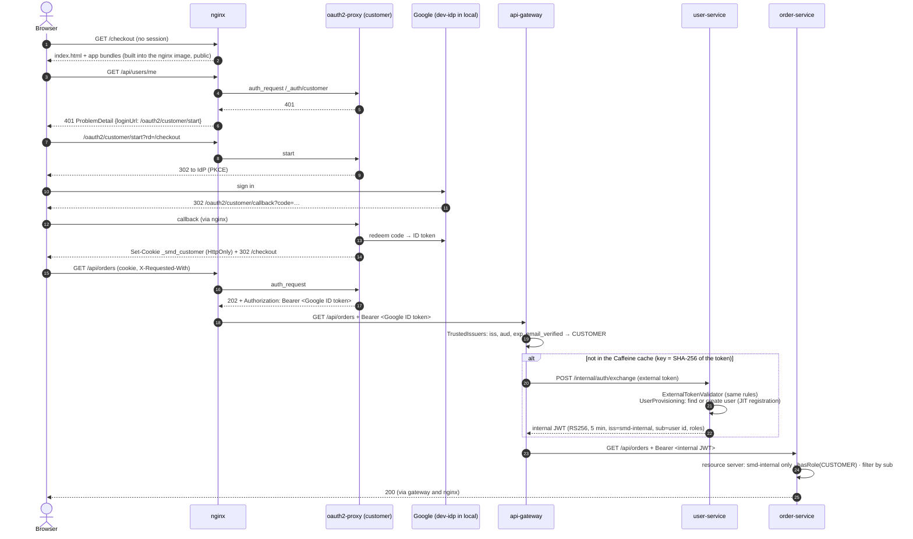

Code:
- `api-gateway`: `security/TrustedIssuers`, `security/SecurityConfig`, `exchange/TokenExchangeFilter`
- `user-service`: `auth/TokenExchangeService`, `auth/UserProvisioning`, `auth/InternalTokenIssuer`
- nginx: `snippets/auth-customer.conf`

Admins follow the same path with the Okta instance (`/oauth2/admin/*`, cookie `_smd_admin`, access token, group `smd-admins`).

## 2. Guest cart → sign-in → merge

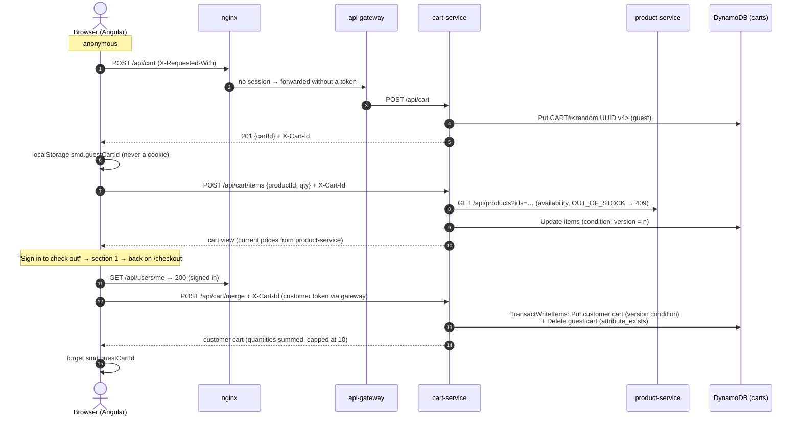

- **Merging is idempotent:** a second merge finds no guest cart and returns the customer's cart unchanged.
- **The customer's cart id** is derived from the user id, so two concurrent "create my cart" requests write the same item and only one wins.

Code:
- `cart-service`: `cart/CartService`, `persistence/CartRepository`
- `frontend`: `core/cart-store.ts`, `core/api.interceptor.ts`

## 3. Checkout: success

Synchronous and ACID: the caller gets `201 CONFIRMED` (or an error) right away.

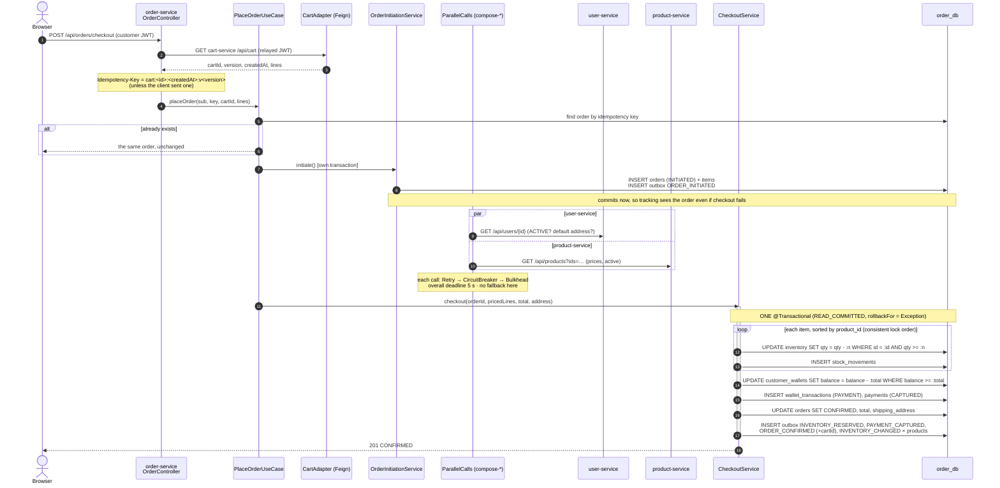

**No remote calls inside the transaction.** The cart isn't touched either: cart-service empties it later, when it sees `ORDER_CONFIRMED` (section 5).

Tests: `CheckoutTest` (happy path, rollback), `CheckoutConcurrencyTest` (10 threads, last unit), `CheckoutFromCartTest`.

## 4. Checkout: rejection and rollback

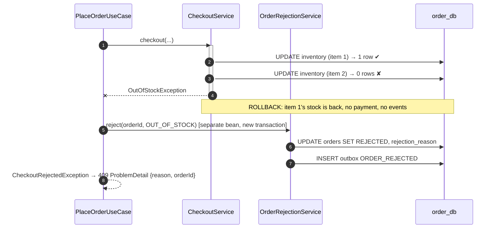

| Failure | Order status | HTTP |
|---|---|---|
| `OUT_OF_STOCK` | REJECTED | 409 |
| `INSUFFICIENT_FUNDS` | REJECTED | 402 |
| `USER_INACTIVE`, `PRODUCT_NOT_FOUND`, `NO_SHIPPING_ADDRESS`, `EMPTY_CART` | REJECTED | 422 |
| `DEPENDENCY_UNAVAILABLE` (a lookup failed or timed out) | FAILED | 503 |

The rejection runs in a **separate bean** on purpose. Calling a `@Transactional` method of the same class bypasses the proxy, so the annotation would silently do nothing.

## 5. After checkout: events through delivery

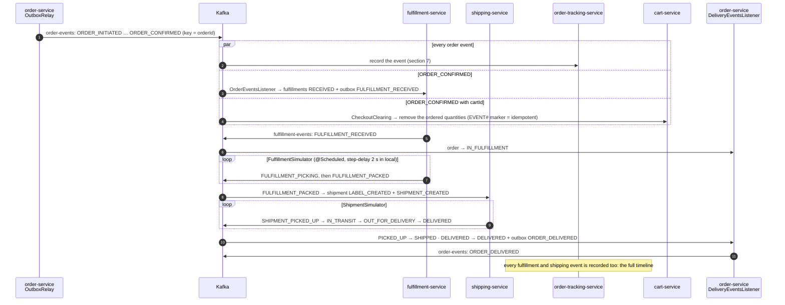

- **Every consumer is idempotent:** a `processed_event` row in the same transaction, or DynamoDB conditions in tracking and cart.
- **Status only moves forward** (`OrderStatus.canAdvanceTo`).
- **Poison records** go to `<topic>.DLT` after 3 attempts.

## 6. Transactional outbox and trace continuation

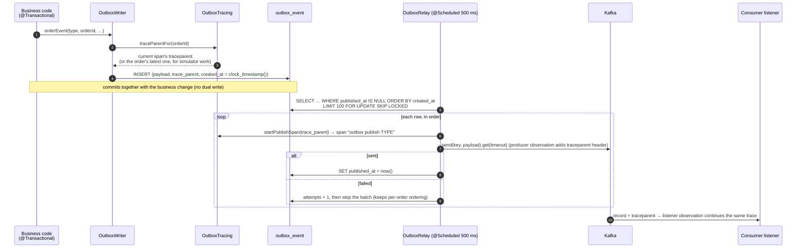

- **Delivery is at least once.** A crash between the Kafka ack and `published_at` re-sends the record, and consumers de-duplicate on `eventId`.
- **One order is one trace in Jaeger**, from the HTTP request to delivery ([observability.md](observability.md)).

## 7. Tracking write: idempotent and forward-only

The core of order-tracking-service (`persistence/TrackingRepository`): one `TransactWriteItems` per event.

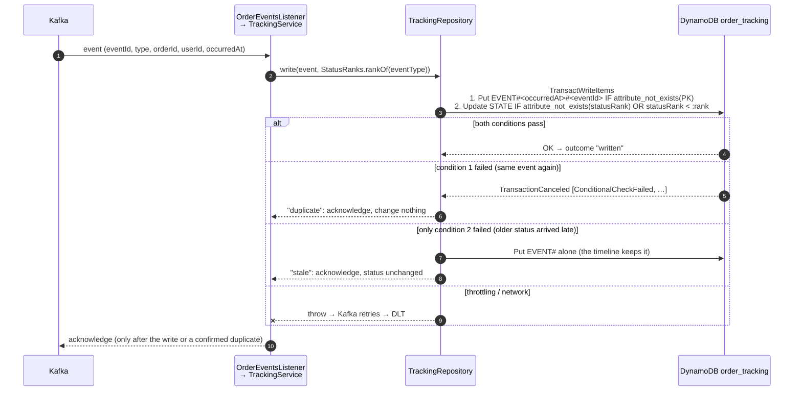

- **Reads are always by key:**
  - `GET /api/tracking/orders/{id}` = one `Query` on `PK = ORDER#<id>`;
  - `/latest` = a strongly consistent `GetItem` on `STATE`, for read-your-writes right after checkout.
- **Admin listings come from order-service (Postgres)**, never a DynamoDB `Scan`.

## 8. Compensation saga: fulfillment fails

A **choreography** saga: no coordinator. order-service reacts to an event and undoes its own work in one local transaction. (An orchestrated saga would have a central component sending commands to each step instead.)

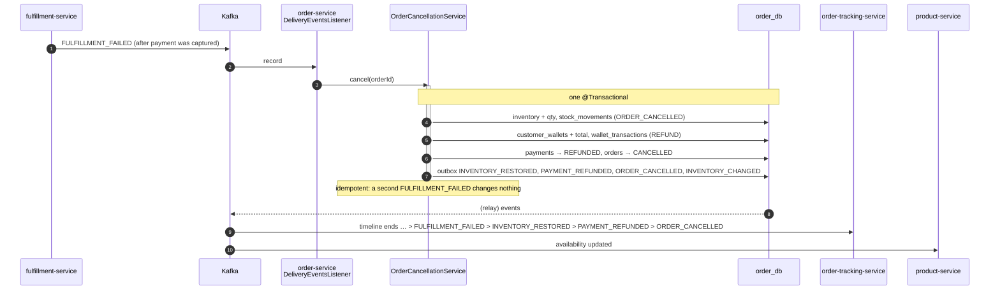

Try it: restart fulfillment-service with `--demo.simulation.failure-rate=1.0` ([README demo 7](../README.md#7-fulfillment-fails--refund--restock)). Test: `CompensationTest`.

## 9. Order details aggregator (parallel fan-out)

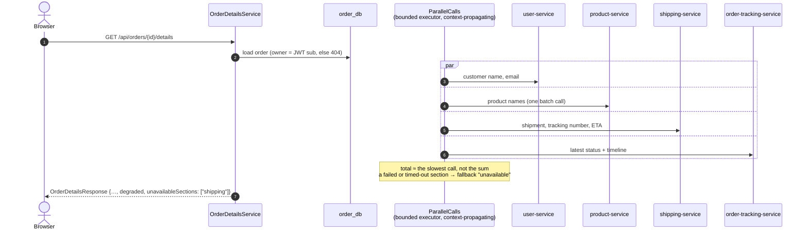

- The JWT, trace and MDC reach the worker threads through `ContextPropagatingTaskDecorator`. Spring Security registers its own context accessor, so the security context travels too (checked by `ParallelCallsTest`).
- The Feign interceptor relays the caller's token on every parallel call.
- Metric: `composition.duration{degraded}`.

## 10. Admin restock → storefront availability

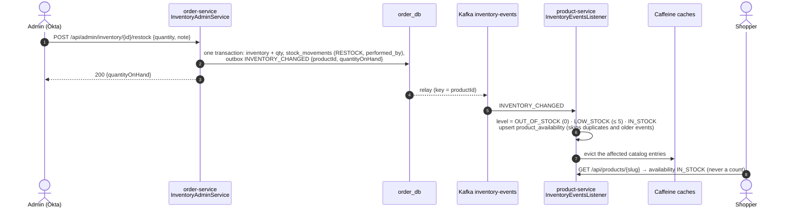

This is **eventually consistent** on purpose. Anonymous catalog traffic never reaches order-service. The authoritative stock check is the checkout transaction, so the worst case is "shown in stock, rejected at checkout with 409".

## 11. Delivery acknowledgement

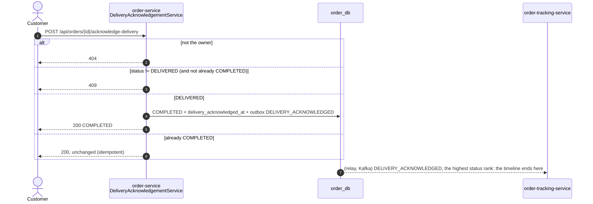

## 12. Loading the app from the edge nginx

One nginx serves the Angular files from its own image and proxies the API. Each kind of file has its own caching rule (`nginx-proxy/nginx/templates/default.conf.template`).

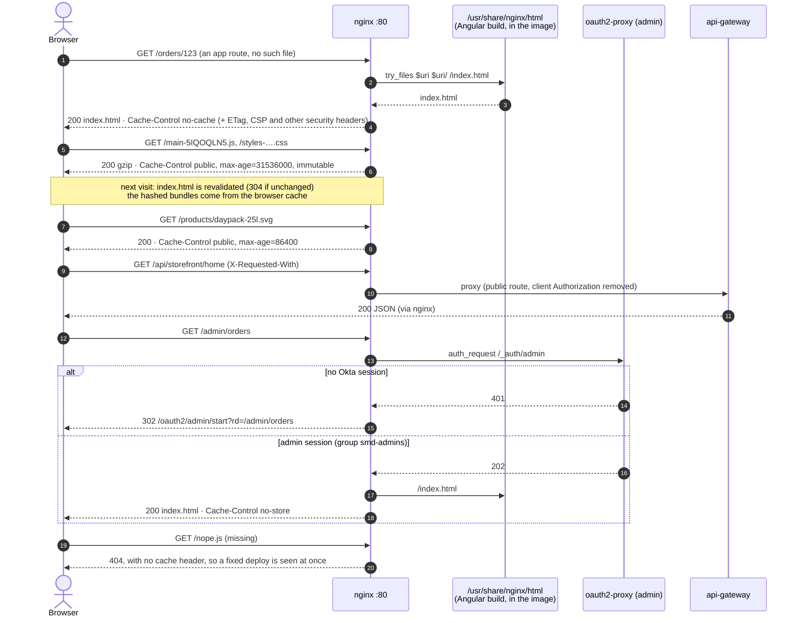

## 13. Building the edge image (app included)

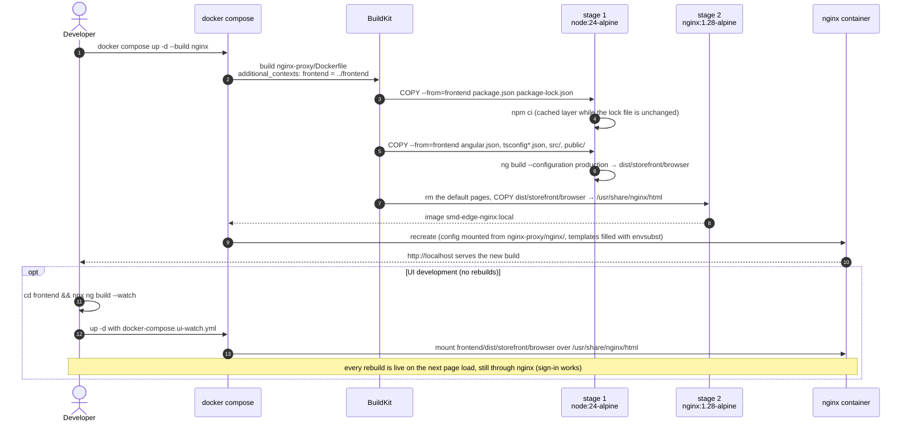

