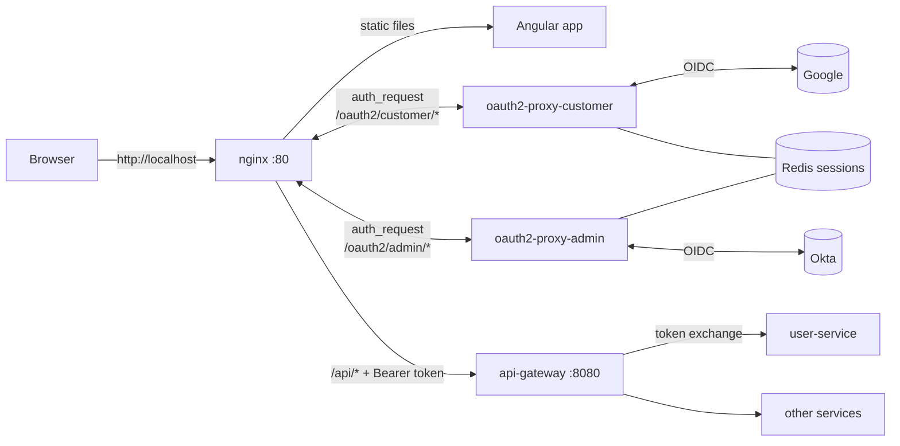

# nginx-proxy

The single front door for the store. **Every** browser request goes through nginx on `http://localhost`:

- the Angular app (static files),
- the login flows: **Google** for customers, **Okta** for admins (through two [oauth2-proxy](https://oauth2-proxy.github.io/oauth2-proxy/) containers),
- the API, forwarded to the Spring Cloud Gateway.

Anyone can browse the store without signing in.



## Files

| File | Purpose |
|---|---|
| `docker-compose.yml` | nginx, the two oauth2-proxy instances, Redis |
| `.env.example` | every setting and secret; copy to `.env` (git-ignored) |
| `nginx/nginx.conf` | main config: JSON access log, correlation id, CSRF guard, rate-limit zones |
| `nginx/templates/default.conf.template` | the site: routes and access rules (`${GATEWAY_UPSTREAM}`, `${SERVER_NAME}` filled in at startup) |
| `nginx/snippets/*.conf` | reusable pieces: security headers, proxy-to-gateway, customer auth, admin auth |

## Who can reach what

| Path | Access at nginx | What nginx forwards |
|---|---|---|
| `/`, `/cart`, `/checkout`, `/orders/...` (UI pages) | public | static files (`index.html` for app routes) |
| `/api/products/**`, `/api/categories/**`, `/api/storefront/**` | **public**, GET/HEAD only | no token (any client-sent `Authorization` is removed) |
| `/api/cart/**` | public **or** customer | the customer's Google ID token if signed in, otherwise nothing (guest cart via `X-Cart-Id`) |
| `/api/orders/**`, `/api/wallet/**`, `/api/users/me`, `/api/tracking/**`, `/api/shipments/**` | **customer** (Google) | `Authorization: Bearer <Google ID token>` |
| `/admin/**` (admin UI pages) | **admin** (Okta, in the admin group) | the same `index.html`; not signed in → redirect to Okta |
| `/api/admin/**` | **admin** (Okta) | `Authorization: Bearer <Okta access token>` |
| `/oauth2/customer/*`, `/oauth2/admin/*` | public | the login flows |
| any other `/api/**`, `/actuator/**`, `/.well-known/jwks.json` | **blocked** (404) | — |

nginx is the **first** line of defense, not the only one. The gateway validates every token again and applies role rules. Each service checks ownership ("customers see only their own orders"). See `../CLAUDE.md` section 6.11.

### How a signed-in request reaches the services

1. The browser holds only an **HttpOnly session cookie** (`_smd_customer` or `_smd_admin`). The tokens themselves stay in Redis and never reach JavaScript.
2. For a protected route, nginx asks oauth2-proxy "is this session valid?" (`auth_request`). The answer includes the token: the Google ID token for customers, the Okta access token for admins.
3. nginx forwards the request to the gateway with `Authorization: Bearer <token>`.
4. The gateway validates the token against Google's or Okta's public keys. It then asks user-service to **exchange** it for an internal JWT, and on the first login user-service creates the user (registration). From there on, the services only see internal JWTs, with the internal user id as `sub`.

### Signing in and out (links for the Angular app)

| Action | URL |
|---|---|
| Customer: sign in with Google, then return to the checkout | `/oauth2/customer/start?rd=/checkout` |
| Customer: sign out | `/oauth2/customer/sign_out?rd=/` |
| Admin: sign in with Okta | `/oauth2/admin/start?rd=/admin` (opening any `/admin` page does this automatically) |
| Admin: sign out | `/oauth2/admin/sign_out?rd=/` |
| "Am I signed in?" | `GET /api/users/me` → `200` with the profile, or `401` with a `loginUrl` |

### CSRF protection

Because sign-in uses cookies, the browser sends them automatically, even on a request triggered by another site. So nginx rejects any `POST`/`PUT`/`DELETE`/`PATCH` to the API that doesn't carry `X-Requested-With: XMLHttpRequest` (403). The Angular HTTP interceptor adds this header to every call. A malicious site can't add a custom header to a cross-site request without a CORS preflight, which we never allow. The cookies are also `SameSite=Lax`.

## Run it

1. **Build the UI** (once the Angular app exists): `cd ../frontend && npx ng build --watch`. nginx serves `frontend/dist/storefront/browser`; change `UI_DIST` in `.env` if your build path differs.
2. **Start the backend** so the gateway listens on `:8080` (see `../CLAUDE.md` section 8).
3. **Configure secrets:** `cp .env.example .env`, then fill in Google and/or Okta values (below). Generate each cookie secret with:
   ```bash
   python3 -c 'import os,base64;print(base64.urlsafe_b64encode(os.urandom(32)).decode())'
   ```
4. **Start nginx:**
   ```bash
   docker compose up -d                                  # public store only
   docker compose --profile google up -d                 # + Google sign-in for customers
   docker compose --profile google --profile okta up -d  # + Okta sign-in for admins
   ```
5. Open http://localhost.

Logs are JSON lines: `docker compose logs -f nginx`.

## Google sign-in setup (customers)

1. Go to the [Google Cloud Console](https://console.cloud.google.com/) and create a project (for example `smd-demo`).
2. Open **Google Auth Platform** (APIs & Services → OAuth consent screen) and click **Get started**:
   - App name `SMD Store`, your support email.
   - Audience **External**, then your contact email. Finish.
3. **Audience:** while the app is in **Testing**, only the Google accounts you add under **Test users** can sign in. Add yourself and anyone testing. (Publishing the app removes this limit. The `openid email profile` scopes don't need Google's verification.)
4. **Clients → Create client:**
   - Application type **Web application**, name `smd-nginx`.
   - Authorized JavaScript origins: `http://localhost`.
   - Authorized redirect URIs: `http://localhost/oauth2/customer/callback`.
5. Copy the **Client ID** and **Client secret** into `.env` (`GOOGLE_CLIENT_ID`, `GOOGLE_CLIENT_SECRET`).
6. The gateway also needs the client ID, to check the token's audience (`aud`). See the gateway's `application.yml` (`security.google.client-id`).

Every Google account that signs in becomes a **customer**. Google accounts can never become admins (enforced by the gateway and by a database constraint).

## Okta setup (admins)

See [`../okta-login-setup/README.md`](../okta-login-setup/README.md).

## Test without real Google/Okta accounts

Use the **dev identity provider** in [`../dev-idp/`](../dev-idp/README.md). It's a mock OIDC server that stands in for Google and Okta, so the two sample users sign in through this exact stack (nginx → oauth2-proxy → gateway):

```bash
docker compose -f docker-compose.yml -f ../dev-idp/docker-compose.dev-idp.yml \
  --profile google --profile okta --profile dev-idp up -d
```

Then open http://localhost:

- "Sign in with Google" → type `sample-customer`.
- `/admin` → type `sample-admin`. `sample-not-admin` is refused.

For API calls without a browser, use `../dev-idp/dev-token.sh customer|admin`.

The routing rules in this folder were also checked while it was written, using fake login servers and a fake gateway: public browsing, guest and customer carts, customer-only and admin-only APIs, the CSRF rule, blocked paths, rate limiting, and stripping of forged headers.

## Troubleshooting

| Symptom | Likely cause |
|---|---|
| `502 Bad Gateway` on `/api/...` | the gateway isn't running on `GATEWAY_UPSTREAM` |
| `502` on `/oauth2/...` or every protected route | that profile's oauth2-proxy isn't running (`--profile google` / `--profile okta`), or it exited: `docker compose logs oauth2-proxy-admin` |
| oauth2-proxy exits with a cookie-secret error | the cookie secret must be 16, 24 or 32 bytes; use the command above |
| Google: `redirect_uri_mismatch` | the redirect URI in Google must be exactly `http://localhost/oauth2/customer/callback` (scheme, host, port, path) |
| Google: "access blocked / app not verified" | the account isn't listed under **Test users** while the app is in Testing |
| `403` on a `POST` from curl | add `-H 'X-Requested-With: XMLHttpRequest'` (CSRF rule) |
| `429` | rate limit: 30 req/s per IP for the catalog, 10 req/s for other API calls, 1 req/s to start a login |
| blank page at `/` | the UI isn't built yet, or `UI_DIST` points to the wrong folder |

## Production notes

- Serve HTTPS (terminate TLS here or at a load balancer), set `COOKIE_SECURE=true`, enable the `Strict-Transport-Security` header in `snippets/security-headers.conf`, and register `https://` redirect URIs.
- Don't publish the gateway's port; only nginx should be reachable.
- Run Redis with persistence and a password if sessions must survive restarts.
