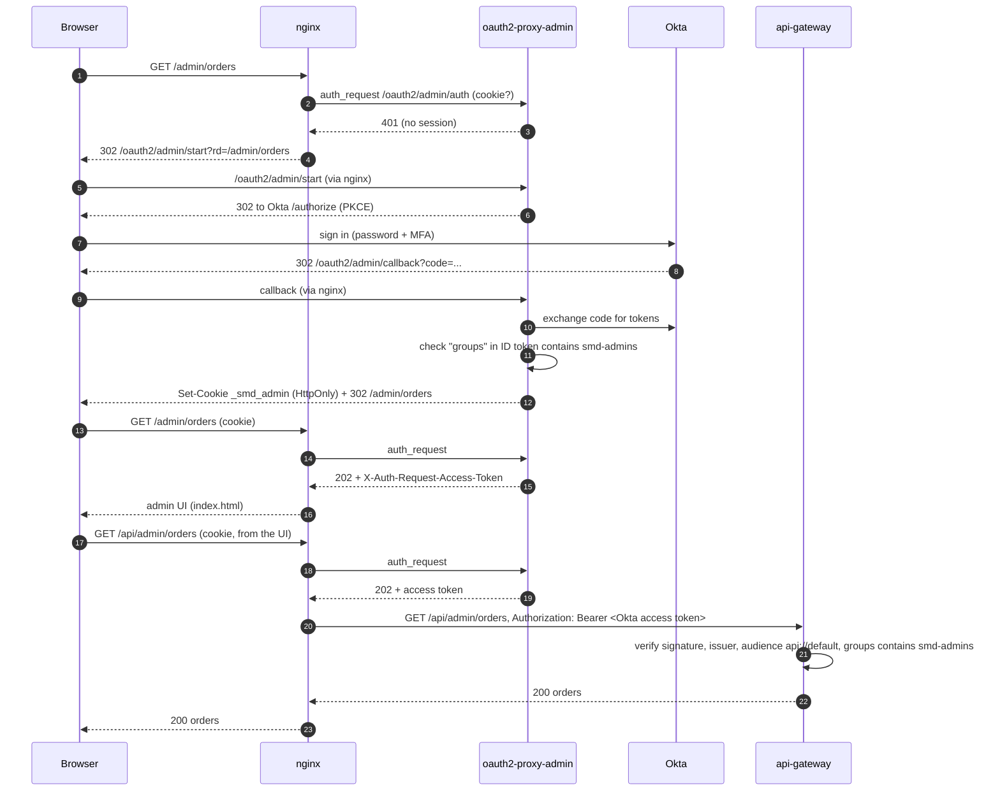

# Okta login setup (admins)

This guide covers how to:

- create a free Okta account,
- register the store's admin app,
- allow **only members of an admin group** to sign in,
- connect it to the nginx proxy so that `/admin/**` and `/api/admin/**` require an Okta login.

Customers never use Okta; they sign in with Google (see `../nginx-proxy/README.md`).

> Okta's admin console changes labels from time to time. If a menu name below doesn't match exactly, look for the closest equivalent. The concepts (app integration, group, authorization server, claims, access policy) stay the same.

## What you'll end up with

| Okta object | Value used in this project |
|---|---|
| Okta domain | e.g. `integrator-1234567.okta.com` → `OKTA_DOMAIN` |
| Group | `smd-admins` → `OKTA_ADMIN_GROUP` |
| App integration | `SMD Admin (nginx)`, OIDC **Web Application** → `OKTA_CLIENT_ID`, `OKTA_CLIENT_SECRET` |
| Authorization server | `default`: issuer `https://<OKTA_DOMAIN>/oauth2/default`, audience `api://default` |
| Claim | `groups` in the ID token **and** the access token |
| Sign-in redirect URI | `http://localhost/oauth2/admin/callback` |

## 1. Create an Okta account

1. Sign up for the free **Okta Integrator Free Plan** at https://developer.okta.com/signup/. (It replaced the old "Developer Edition".)
2. Okta requires **Okta Verify** (the authenticator app) during signup. Have your phone ready.
3. Note your **Okta domain**, shown in the admin console and the welcome email, e.g. `integrator-1234567.okta.com`. The admin console is usually at `https://integrator-1234567-admin.okta.com`.

## 2. Create the admin group and an admin user

1. **Directory → Groups → Add group**: name `smd-admins`, description "Admins of the SMD store".
2. **Directory → People → Add person**: create the person who will manage the store (or use your own Okta account). Activate them and set a password.
3. Open the `smd-admins` group → **Assign people** → add that person.

Only members of `smd-admins` will be able to reach the admin pages. Anyone else gets a "not assigned" error from Okta, or a 403 from the proxy.

## 3. Register the app (OIDC Web Application)

1. **Applications → Applications → Create App Integration**.
2. Sign-in method: **OIDC – OpenID Connect**. Application type: **Web Application** (it has a client secret; the secret stays on the server inside oauth2-proxy). Click **Next**.
3. Settings:
   - **App integration name:** `SMD Admin (nginx)`.
   - **Grant type:** keep **Authorization Code**, and also tick **Refresh Token** (lets the proxy renew tokens without making the admin sign in again).
   - **Sign-in redirect URIs:** `http://localhost/oauth2/admin/callback`.
   - **Sign-out redirect URIs:** `http://localhost/`.
   - **Assignments → Controlled access:** **Limit access to selected groups** → `smd-admins`.
4. **Save.**
5. On the app's **General** tab, under **Client Credentials**, copy the **Client ID** and **Client secret**. If you see **Require PKCE as additional verification**, turn it on (the proxy uses PKCE with S256).

## 4. Put the groups into the tokens

The proxy decides who may enter by reading the `groups` claim from the **ID token**. The gateway assigns the `ADMIN` role by reading `groups` from the **access token**. So the claim must be in both.

1. **Security → API → Authorization Servers →** `default`.
   - Note the **Issuer URI**: `https://<OKTA_DOMAIN>/oauth2/default`.
   - Note the **Audience**: `api://default`.
   - Use this *custom* `default` server, not the org server (`https://<OKTA_DOMAIN>` without `/oauth2/default`). Only custom authorization servers issue access tokens that APIs can validate.
2. **Claims** tab → **Add Claim**:
   - Name: `groups`.
   - Include in token type: **Access Token**, **Always**.
   - Value type: **Groups**.
   - Filter: **Matches regex**, `^smd-.*$` (only this app's groups, not every group the user is in).
   - Include in: **Any scope**.
3. **Add Claim** again with the same settings but token type **ID Token**, **Always**.
4. **Access Policies** tab: there must be a policy that covers `SMD Admin (nginx)` with a rule allowing the **Authorization Code** and **Refresh Token** grants. Free orgs usually have a **Default Policy** for all clients that already does this. If not:
   - **Add New Access Policy** `SMD admin`, assigned to the app.
   - **Add Rule** `Admins`: grant types Authorization Code + Refresh Token; user is in group `smd-admins`; any scopes.
   - Access token lifetime **1 hour**; refresh token lifetime about **8 hours** (matches the proxy's `--cookie-expire=8h`).
5. **Token Preview** tab: pick the app, grant type Authorization Code, your admin user, scopes `openid profile email offline_access`, then **Preview Token**. Check that both the ID token and the access token contain `"groups": ["smd-admins"]`.

## 5. Require MFA for admins (recommended)

**Security → Authentication Policies:** create (or edit) the policy used by `SMD Admin (nginx)` so that members of `smd-admins` must use **Password + Okta Verify** (or another strong factor). Admins can restock inventory and see every order and payment, so they should not be protected by a password alone.

## 6. Connect Okta to the nginx proxy

In `../nginx-proxy/.env`:

```dotenv
OKTA_DOMAIN=integrator-1234567.okta.com
OKTA_CLIENT_ID=0oa...
OKTA_CLIENT_SECRET=...
OKTA_ADMIN_GROUP=smd-admins
# python3 -c 'import os,base64;print(base64.urlsafe_b64encode(os.urandom(32)).decode())'
ADMIN_COOKIE_SECRET=...
```

Start (or restart) the proxy with the Okta profile:

```bash
cd ../nginx-proxy
docker compose --profile okta up -d               # admins only
docker compose --profile google --profile okta up -d  # customers + admins
```

The gateway must trust the same issuer. In the gateway's configuration (spec in `../CLAUDE.md` 6.11):

```yaml
security:
  okta:
    issuer-uri: https://${OKTA_DOMAIN}/oauth2/default
    audience: api://default
    admin-group: smd-admins
```

## 7. How nginx protects the admin URLs



The relevant pieces of config:

| Where | What it does |
|---|---|
| `nginx-proxy/nginx/snippets/auth-admin.conf` | `auth_request /_auth/admin`; takes the access token from oauth2-proxy and sends it on as `Authorization: Bearer …` |
| `nginx-proxy/nginx/templates/default.conf.template`, `location ^~ /admin` | admin UI pages: not signed in → `302` to the Okta login |
| same file, `location /api/admin/` | admin API: not signed in → `401` JSON with `loginUrl`; state-changing calls also need the CSRF header |
| same file, `location /oauth2/admin/` | the login, callback and sign-out endpoints of oauth2-proxy-admin |
| `nginx-proxy/docker-compose.yml`, `oauth2-proxy-admin` | Okta issuer, client, `--allowed-group=smd-admins`, `--pass-access-token`, Redis session store |

**Defense in depth**: each layer stops a non-admin on its own:

1. **Okta app assignment:** only `smd-admins` members may sign in to this app at all.
2. **oauth2-proxy `--allowed-group`:** refuses a session whose ID token lacks the group.
3. **nginx `auth_request`:** no valid admin session → no access to `/admin` or `/api/admin`.
4. **Gateway:** validates the Okta access token itself (signature, issuer, `aud = api://default`, expiry) and grants `ADMIN` only if `groups` contains `smd-admins`. A Google token can never get `ADMIN`.
5. **Services:** `@PreAuthorize("hasRole('ADMIN')")` on every admin controller.
6. **Database:** `user_db.users` has a constraint that an `OKTA` user is always `ADMIN` and a `GOOGLE` user is always `CUSTOMER`.

## 8. Test it

1. In a private window, open http://localhost/admin. You should land on the Okta sign-in page, then come back to `/admin` after signing in.
2. Without a session, the admin API answers with JSON, not a login page:
   ```bash
   curl -i http://localhost/api/admin/orders
   # HTTP/1.1 401 ... {"title":"Admin login required", "loginUrl":"/oauth2/admin/start", ...}
   ```
3. Sign in with an Okta user who is **not** in `smd-admins`. Okta shows "User is not assigned to the client application" (layer 1). If you removed the assignment rule to test layer 2, oauth2-proxy answers **403 Permission Denied**.
4. A customer signed in with Google who opens http://localhost/admin is sent to the Okta login: the Google session means nothing here.
5. Sign out at http://localhost/oauth2/admin/sign_out?rd=/. This ends the store session. The Okta session itself stays alive until it times out or the user signs out of Okta, so the next sign-in may not ask for a password. To force re-authentication, shorten the Okta session lifetime in the authentication policy.

## Troubleshooting

| Symptom | Cause and fix |
|---|---|
| `oauth2-proxy-admin` exits on startup | wrong `OKTA_DOMAIN` (no `https://`, no trailing `/`), or the issuer isn't reachable. Check `docker compose logs oauth2-proxy-admin` |
| Okta: `redirect_uri` error | the app's sign-in redirect URI must be exactly `http://localhost/oauth2/admin/callback` |
| Okta: "User is not assigned to the client application" | add the user to `smd-admins` (and the group to the app's assignments) |
| Okta: `invalid_scope` / `offline_access` not allowed | tick **Refresh Token** in the app's grant types, and make sure the access-policy rule allows it |
| Okta: "Policy evaluation failed" / no matching policy | add an access policy + rule on the `default` authorization server that covers this app (step 4.4) |
| oauth2-proxy: **403 Permission Denied** after a successful Okta login | the ID token has no `groups` claim, or the group name differs from `OKTA_ADMIN_GROUP`. Check with **Token Preview** |
| Gateway: `401` with `invalid_token` / audience | the gateway expects `aud = api://default` and the issuer `/oauth2/default`; tokens from the org server (`https://<domain>` without `/oauth2/default`) are rejected |
| Gateway: `403` on `/api/admin/**` | the access token has no `groups` (step 4.2), or it holds a different group |
| Signed out but still signed in | expected (Okta SSO session), see test step 5 |

## Production checklist

- HTTPS everywhere: register `https://<your-domain>/oauth2/admin/callback`, set `COOKIE_SECURE=true` and `PUBLIC_BASE_URL=https://<your-domain>`.
- One Okta app per environment (dev/staging/prod), each with its own redirect URIs and secret. Store the secret in a secrets manager, not in `.env`.
- Rotate the client secret periodically (the app's **Client Credentials** section).
- MFA required for `smd-admins` (step 5), and short admin session lifetimes.
- Consider a custom Okta domain (e.g. `login.example.com`) so the sign-in page shows your brand.
